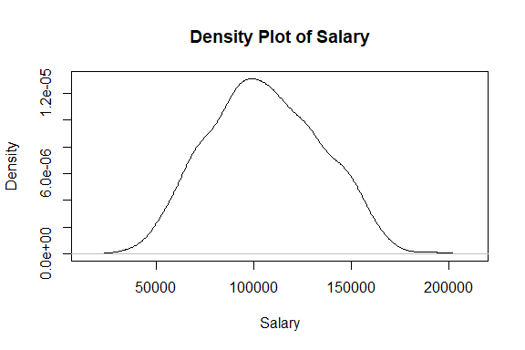

Job Salary Prediction
================
Trevor Okinda
2024

- [Student Details](#student-details)
- [Setup Chunk](#setup-chunk)
- [Understanding the Dataset (Exploratory Data Analysis
  (EDA))](#understanding-the-dataset-exploratory-data-analysis-eda)
  - [Loading the Dataset](#loading-the-dataset)
    - [Source:](#source)
    - [Reference:](#reference)
- [Exploratory Data Analysis](#exploratory-data-analysis)
  - [Load dataset](#load-dataset)
  - [Measures of frequency](#measures-of-frequency)
  - [Measures of Central Tendency](#measures-of-central-tendency)
  - [Measures of Distribution](#measures-of-distribution)
  - [Measures of Relationship](#measures-of-relationship)
  - [ANOVA](#anova)
- [Preprocessing and Data
  Transformation](#preprocessing-and-data-transformation)
  - [Missing Values](#missing-values)
- [Training Model](#training-model)
  - [Data splitting](#data-splitting)
  - [Bootstrapping](#bootstrapping)
  - [Cross-validation](#cross-validation)
  - [Training Model](#training-model-1)
  - [Performance comparison](#performance-comparison)

# Student Details

|                       |                       |
|-----------------------|-----------------------|
| **Student ID Number** | 134780                |
| **Student Name**      | Trevor Okinda         |
| **BBIT 4.2 Group**    | C                     |
| **Project Name**      | Job Salary Prediction |

# Setup Chunk

**Note:** the following KnitR options have been set as the global
defaults: <BR>
`knitr::opts_chunk$set(echo = TRUE, warning = FALSE, eval = TRUE, collapse = FALSE, tidy = TRUE)`.

More KnitR options are documented here
<https://bookdown.org/yihui/rmarkdown-cookbook/chunk-options.html> and
here <https://yihui.org/knitr/options/>.

# Understanding the Dataset (Exploratory Data Analysis (EDA))

## Loading the Dataset

### Source:

The dataset that was used can be downloaded here: *\<<a
href="https://www.kaggle.com/datasets/mrsimple07/salary-prediction-data\"
class="uri">https://www.kaggle.com/datasets/mrsimple07/salary-prediction-data\</a>\>*

### Reference:

*\<MrSimple. (2023). Salary Prediction Data \[Dataset\]. Kaggle.
Retrieved from <a
href="https://www.kaggle.com/datasets/mrsimple07/salary-prediction-data/\"
class="uri">https://www.kaggle.com/datasets/mrsimple07/salary-prediction-data/\</a>\>  
Refer to the APA 7th edition manual for rules on how to cite datasets:
<https://apastyle.apa.org/style-grammar-guidelines/references/examples/data-set-references>*

# Exploratory Data Analysis

## Load dataset

``` r
# Load dataset
salary_data <- read.csv("salary_prediction_data.csv", colClasses = c(
  Education = "factor",
  Experience = "integer",
  Location = "factor",
  Job_Title = "factor",
  Age = "integer",
  Gender = "factor",
  Salary = "numeric"
))

# Display the structure of the dataset
str(salary_data)
```

    ## 'data.frame':    1000 obs. of  7 variables:
    ##  $ Education : Factor w/ 4 levels "Bachelor","High School",..: 2 4 1 2 4 4 4 4 1 4 ...
    ##  $ Experience: int  8 11 28 29 25 19 4 13 20 14 ...
    ##  $ Location  : Factor w/ 3 levels "Rural","Suburban",..: 3 2 2 1 3 1 1 2 3 3 ...
    ##  $ Job_Title : Factor w/ 4 levels "Analyst","Director",..: 4 2 4 2 1 2 2 2 3 1 ...
    ##  $ Age       : int  63 59 61 45 26 27 60 49 25 58 ...
    ##  $ Gender    : Factor w/ 2 levels "Female","Male": 2 2 1 2 1 1 1 1 1 1 ...
    ##  $ Salary    : num  84620 142591 97800 96835 132158 ...

``` r
# View the first few rows of the dataset
head(salary_data)
```

    ##     Education Experience Location Job_Title Age Gender    Salary
    ## 1 High School          8    Urban   Manager  63   Male  84620.05
    ## 2         PhD         11 Suburban  Director  59   Male 142591.26
    ## 3    Bachelor         28 Suburban   Manager  61 Female  97800.26
    ## 4 High School         29    Rural  Director  45   Male  96834.67
    ## 5         PhD         25    Urban   Analyst  26 Female 132157.79
    ## 6         PhD         19    Rural  Director  27 Female 156312.94

``` r
# View the dataset in a separate viewer window
View(salary_data)
```

## Measures of frequency

``` r
# Measures of Frequency
# Frequency table for Education
education_freq <- table(salary_data$Education)
print("Frequency table for Education:")
```

    ## [1] "Frequency table for Education:"

``` r
print(education_freq)
```

    ## 
    ##    Bachelor High School      Master         PhD 
    ##         253         255         241         251

``` r
# Frequency table for Location
location_freq <- table(salary_data$Location)
print("Frequency table for Location:")
```

    ## [1] "Frequency table for Location:"

``` r
print(location_freq)
```

    ## 
    ##    Rural Suburban    Urban 
    ##      345      345      310

``` r
# Frequency table for Job_Title
job_title_freq <- table(salary_data$Job_Title)
print("Frequency table for Job_Title:")
```

    ## [1] "Frequency table for Job_Title:"

``` r
print(job_title_freq)
```

    ## 
    ##  Analyst Director Engineer  Manager 
    ##      255      275      229      241

``` r
# Summary of Gender
gender_summary <- summary(salary_data$Gender)
print("Summary of Gender:")
```

    ## [1] "Summary of Gender:"

``` r
print(gender_summary)
```

    ## Female   Male 
    ##    484    516

## Measures of Central Tendency

``` r
# Measures of Central Tendency
# Mean, Median, Mode for Experience
experience_mean <- mean(salary_data$Experience)
experience_median <- median(salary_data$Experience)
experience_mode <- as.numeric(names(sort(table(salary_data$Experience), decreasing = TRUE)[1]))
print("Measures of central tendency for Experience:")
```

    ## [1] "Measures of central tendency for Experience:"

``` r
print(paste("Mean:", experience_mean))
```

    ## [1] "Mean: 14.771"

``` r
print(paste("Median:", experience_median))
```

    ## [1] "Median: 15"

``` r
print(paste("Mode:", experience_mode))
```

    ## [1] "Mode: 17"

``` r
# Mean, Median, Mode for Age
age_mean <- mean(salary_data$Age)
age_median <- median(salary_data$Age)
age_mode <- as.numeric(names(sort(table(salary_data$Age), decreasing = TRUE)[1]))
print("Measures of central tendency for Age:")
```

    ## [1] "Measures of central tendency for Age:"

``` r
print(paste("Mean:", age_mean))
```

    ## [1] "Mean: 42.377"

``` r
print(paste("Median:", age_median))
```

    ## [1] "Median: 43"

``` r
print(paste("Mode:", age_mode))
```

    ## [1] "Mode: 27"

``` r
# Mean, Median for Salary
salary_mean <- mean(salary_data$Salary)
salary_median <- median(salary_data$Salary)
print("Measures of central tendency for Salary:")
```

    ## [1] "Measures of central tendency for Salary:"

``` r
print(paste("Mean:", salary_mean))
```

    ## [1] "Mean: 105558.404238781"

``` r
print(paste("Median:", salary_median))
```

    ## [1] "Median: 104314.518314845"

## Measures of Distribution

``` r
# Measures of Distribution
# Range for Experience
experience_range <- range(salary_data$Experience)
print("Range for Experience:")
```

    ## [1] "Range for Experience:"

``` r
print(experience_range)
```

    ## [1]  1 29

``` r
# Range for Age
age_range <- range(salary_data$Age)
print("Range for Age:")
```

    ## [1] "Range for Age:"

``` r
print(age_range)
```

    ## [1] 20 64

``` r
# Range for Salary
salary_range <- range(salary_data$Salary)
print("Range for Salary:")
```

    ## [1] "Range for Salary:"

``` r
print(salary_range)
```

    ## [1]  33510.51 193016.60

``` r
# Variance for Experience
experience_variance <- var(salary_data$Experience)
print("Variance for Experience:")
```

    ## [1] "Variance for Experience:"

``` r
print(experience_variance)
```

    ## [1] 69.57413

``` r
# Variance for Age
age_variance <- var(salary_data$Age)
print("Variance for Age:")
```

    ## [1] "Variance for Age:"

``` r
print(age_variance)
```

    ## [1] 185.2161

``` r
# Variance for Salary
salary_variance <- var(salary_data$Salary)
print("Variance for Salary:")
```

    ## [1] "Variance for Salary:"

``` r
print(salary_variance)
```

    ## [1] 798456471

``` r
# Standard Deviation for Experience
experience_sd <- sd(salary_data$Experience)
print("Standard Deviation for Experience:")
```

    ## [1] "Standard Deviation for Experience:"

``` r
print(experience_sd)
```

    ## [1] 8.341111

``` r
# Standard Deviation for Age
age_sd <- sd(salary_data$Age)
print("Standard Deviation for Age:")
```

    ## [1] "Standard Deviation for Age:"

``` r
print(age_sd)
```

    ## [1] 13.60941

``` r
# Standard Deviation for Salary
salary_sd <- sd(salary_data$Salary)
print("Standard Deviation for Salary:")
```

    ## [1] "Standard Deviation for Salary:"

``` r
print(salary_sd)
```

    ## [1] 28256.97

``` r
# Quartiles for Experience
experience_quartiles <- quantile(salary_data$Experience, probs = c(0.25, 0.5, 0.75))
print("Quartiles for Experience:")
```

    ## [1] "Quartiles for Experience:"

``` r
print(experience_quartiles)
```

    ## 25% 50% 75% 
    ##   7  15  22

``` r
# Quartiles for Age
age_quartiles <- quantile(salary_data$Age, probs = c(0.25, 0.5, 0.75))
print("Quartiles for Age:")
```

    ## [1] "Quartiles for Age:"

``` r
print(age_quartiles)
```

    ## 25% 50% 75% 
    ##  30  43  55

``` r
# Quartiles for Salary
salary_quartiles <- quantile(salary_data$Salary, probs = c(0.25, 0.5, 0.75))
print("Quartiles for Salary:")
```

    ## [1] "Quartiles for Salary:"

``` r
print(salary_quartiles)
```

    ##       25%       50%       75% 
    ##  85032.14 104314.52 126804.05

## Measures of Relationship

``` r
# Measures of Relationship
# Correlation between Age and Salary
age_salary_correlation <- cor(salary_data$Age, salary_data$Salary)
print("Correlation between Age and Salary:")
```

    ## [1] "Correlation between Age and Salary:"

``` r
print(age_salary_correlation)
```

    ## [1] -0.05317351

``` r
# Covariance between Experience and Salary
experience_salary_covariance <- cov(salary_data$Experience, salary_data$Salary)
print("Covariance between Experience and Salary:")
```

    ## [1] "Covariance between Experience and Salary:"

``` r
print(experience_salary_covariance)
```

    ## [1] 80588.19

## ANOVA

``` r
# ANOVA for Salary across different levels of Education
anova_result <- aov(Salary ~ Education, data = salary_data)
print("ANOVA for Salary across different levels of Education:")
```

    ## [1] "ANOVA for Salary across different levels of Education:"

``` r
print(summary(anova_result))
```

    ##              Df    Sum Sq   Mean Sq F value Pr(>F)    
    ## Education     3 5.004e+11 1.668e+11   558.9 <2e-16 ***
    ## Residuals   996 2.972e+11 2.984e+08                   
    ## ---
    ## Signif. codes:  0 '***' 0.001 '**' 0.01 '*' 0.05 '.' 0.1 ' ' 1

``` r
# ANOVA for Salary across different levels of Location
anova_result <- aov(Salary ~ Location, data = salary_data)
print("ANOVA for Salary across different levels of Location:")
```

    ## [1] "ANOVA for Salary across different levels of Location:"

``` r
print(summary(anova_result))
```

    ##              Df    Sum Sq   Mean Sq F value  Pr(>F)    
    ## Location      2 2.676e+10 1.338e+10    17.3 4.1e-08 ***
    ## Residuals   997 7.709e+11 7.732e+08                    
    ## ---
    ## Signif. codes:  0 '***' 0.001 '**' 0.01 '*' 0.05 '.' 0.1 ' ' 1

``` r
# ANOVA for Salary across different levels of Job_Title
anova_result <- aov(Salary ~ Job_Title, data = salary_data)
print("ANOVA for Salary across different levels of Job_Title:")
```

    ## [1] "ANOVA for Salary across different levels of Job_Title:"

``` r
print(summary(anova_result))
```

    ##              Df    Sum Sq   Mean Sq F value Pr(>F)    
    ## Job_Title     3 1.155e+11 3.849e+10    56.2 <2e-16 ***
    ## Residuals   996 6.822e+11 6.849e+08                   
    ## ---
    ## Signif. codes:  0 '***' 0.001 '**' 0.01 '*' 0.05 '.' 0.1 ' ' 1

\##Plots

``` r
# Univariate Plots
# Histogram for Age
hist(salary_data$Age, main = "Histogram of Age", xlab = "Age")
```

<!-- -->

``` r
# Boxplot for Experience
boxplot(salary_data$Experience, main = "Boxplot of Experience", ylab = "Experience")
```

<!-- -->

``` r
# Density plot for Salary
plot(density(salary_data$Salary), main = "Density Plot of Salary", xlab = "Salary", ylab = "Density")
```

<!-- -->

``` r
# Barplot for Education
barplot(table(salary_data$Education), main = "Barplot of Education", xlab = "Education", ylab = "Frequency")
```

<!-- -->

``` r
# Pie chart for Gender
pie(table(salary_data$Gender), main = "Pie Chart of Gender")

# Load required libraries
library(ggplot2)
```

<!-- -->

``` r
# Multivariate Plots
# Scatter plot of Salary vs. Age
ggplot(salary_data, aes(x = Age, y = Salary)) +
  geom_point() +
  labs(title = "Scatter Plot of Salary vs. Age", x = "Age", y = "Salary")
```

<!-- -->

``` r
# Pair plot of Age, Experience, and Salary
pairs(~ Age + Experience + Salary, data = salary_data,
      main = "Pair Plot of Age, Experience, and Salary")
```

<!-- -->

``` r
# Heatmap of correlation matrix
correlation_matrix <- cor(salary_data[c("Experience", "Age", "Salary")])
heatmap(correlation_matrix, 
        Colv = NA, Rowv = NA,
        main = "Heatmap of Correlation Matrix",
        xlab = "Variables", ylab = "Variables")
```

<!-- -->

# Preprocessing and Data Transformation

## Missing Values

``` r
# Check for missing values
missing_values <- anyNA(salary_data)
if (missing_values) {
  print("Missing values are present in the dataset.")
} else {
  print("No missing values are present in the dataset.")
}
```

    ## [1] "No missing values are present in the dataset."

``` r
# Round off Salary to 2 decimal places
salary_data$Salary <- round(salary_data$Salary, 2)

# View the first few rows of the updated dataset
head(salary_data)
```

    ##     Education Experience Location Job_Title Age Gender    Salary
    ## 1 High School          8    Urban   Manager  63   Male  84620.05
    ## 2         PhD         11 Suburban  Director  59   Male 142591.26
    ## 3    Bachelor         28 Suburban   Manager  61 Female  97800.26
    ## 4 High School         29    Rural  Director  45   Male  96834.67
    ## 5         PhD         25    Urban   Analyst  26 Female 132157.79
    ## 6         PhD         19    Rural  Director  27 Female 156312.94

# Training Model

## Data splitting

``` r
# Load required library
library(caret)
```

    ## Loading required package: lattice

``` r
# Set seed for reproducibility
set.seed(123)

# Split data into training and testing sets
train_index <- createDataPartition(salary_data$Salary, p = 0.8, list = FALSE)
train_data <- salary_data[train_index, ]
test_data <- salary_data[-train_index, ]

# Display the dimensions of the training and testing sets
print("Dimensions of Training Set:")
```

    ## [1] "Dimensions of Training Set:"

``` r
print(dim(train_data))
```

    ## [1] 800   7

``` r
print("Dimensions of Testing Set:")
```

    ## [1] "Dimensions of Testing Set:"

``` r
print(dim(test_data))
```

    ## [1] 200   7

## Bootstrapping

``` r
# Load required library
library(boot)
```

    ## 
    ## Attaching package: 'boot'

    ## The following object is masked from 'package:lattice':
    ## 
    ##     melanoma

``` r
# Define the function to calculate the statistic of interest (e.g., mean)
statistic_function <- function(data, indices) {
  sampled_data <- data[indices, ]
  # Here, you can compute any statistic you're interested in
  # For example, let's compute the mean of Salary
  mean_salary <- mean(sampled_data$Salary)
  return(mean_salary)
}

# Set seed for reproducibility
set.seed(123)

# Perform bootstrapping
bootstrap_results <- boot(data = salary_data, statistic = statistic_function, R = 1000)

# Print the bootstrapped confidence interval
print(boot.ci(bootstrap_results, type = "basic"))
```

    ## BOOTSTRAP CONFIDENCE INTERVAL CALCULATIONS
    ## Based on 1000 bootstrap replicates
    ## 
    ## CALL : 
    ## boot.ci(boot.out = bootstrap_results, type = "basic")
    ## 
    ## Intervals : 
    ## Level      Basic         
    ## 95%   (103699, 107413 )  
    ## Calculations and Intervals on Original Scale

## Cross-validation

``` r
#Cross-Validation
# Set seed for reproducibility
set.seed(123)

# Define training control
train_control <- trainControl(method = "cv", number = 10)  # 10-fold cross-validation

# Train the model using cross-validation
# Here, you can replace 'lm' with any other modeling function (e.g., 'glm', 'randomForest')
model <- train(Salary ~ ., data = salary_data, method = "lm", trControl = train_control)

# Print the cross-validation results
print(summary(model))
```

    ## 
    ## Call:
    ## lm(formula = .outcome ~ ., data = dat)
    ## 
    ## Residuals:
    ##    Min     1Q Median     3Q    Max 
    ## -34770  -6626   -197   6770  39713 
    ## 
    ## Coefficients:
    ##                          Estimate Std. Error t value Pr(>|t|)    
    ## (Intercept)             63852.076   1442.839  44.254  < 2e-16 ***
    ## `EducationHigh School` -18042.169    883.365 -20.424  < 2e-16 ***
    ## EducationMaster         21011.933    899.617  23.357  < 2e-16 ***
    ## EducationPhD            40059.613    888.291  45.097  < 2e-16 ***
    ## Experience               1031.188     38.013  27.128  < 2e-16 ***
    ## LocationSuburban         3909.837    764.625   5.113 3.80e-07 ***
    ## LocationUrban            9279.792    783.752  11.840  < 2e-16 ***
    ## Job_TitleDirector       25384.571    865.920  29.315  < 2e-16 ***
    ## Job_TitleEngineer        4821.028    910.899   5.293 1.49e-07 ***
    ## Job_TitleManager        15782.775    896.001  17.615  < 2e-16 ***
    ## Age                        -9.921     23.243  -0.427     0.67    
    ## GenderMale                509.599    631.756   0.807     0.42    
    ## ---
    ## Signif. codes:  0 '***' 0.001 '**' 0.01 '*' 0.05 '.' 0.1 ' ' 1
    ## 
    ## Residual standard error: 9930 on 988 degrees of freedom
    ## Multiple R-squared:  0.8779, Adjusted R-squared:  0.8765 
    ## F-statistic: 645.5 on 11 and 988 DF,  p-value: < 2.2e-16

## Training Model

``` r
# Train a linear regression model
lm_model <- lm(Salary ~ ., data = salary_data)

# Print the summary of the trained model
summary(lm_model)
```

    ## 
    ## Call:
    ## lm(formula = Salary ~ ., data = salary_data)
    ## 
    ## Residuals:
    ##    Min     1Q Median     3Q    Max 
    ## -34770  -6626   -197   6770  39713 
    ## 
    ## Coefficients:
    ##                        Estimate Std. Error t value Pr(>|t|)    
    ## (Intercept)           63852.076   1442.839  44.254  < 2e-16 ***
    ## EducationHigh School -18042.169    883.365 -20.424  < 2e-16 ***
    ## EducationMaster       21011.933    899.617  23.357  < 2e-16 ***
    ## EducationPhD          40059.613    888.291  45.097  < 2e-16 ***
    ## Experience             1031.188     38.013  27.128  < 2e-16 ***
    ## LocationSuburban       3909.837    764.625   5.113 3.80e-07 ***
    ## LocationUrban          9279.792    783.752  11.840  < 2e-16 ***
    ## Job_TitleDirector     25384.571    865.920  29.315  < 2e-16 ***
    ## Job_TitleEngineer      4821.028    910.899   5.293 1.49e-07 ***
    ## Job_TitleManager      15782.775    896.001  17.615  < 2e-16 ***
    ## Age                      -9.921     23.243  -0.427     0.67    
    ## GenderMale              509.599    631.756   0.807     0.42    
    ## ---
    ## Signif. codes:  0 '***' 0.001 '**' 0.01 '*' 0.05 '.' 0.1 ' ' 1
    ## 
    ## Residual standard error: 9930 on 988 degrees of freedom
    ## Multiple R-squared:  0.8779, Adjusted R-squared:  0.8765 
    ## F-statistic: 645.5 on 11 and 988 DF,  p-value: < 2.2e-16

``` r
# Load required library
library(rpart)

# Train a decision tree model
tree_model <- rpart(Salary ~ ., data = salary_data)

# Print the summary of the trained model
print(tree_model)
```

    ## n= 1000 
    ## 
    ## node), split, n, deviance, yval
    ##       * denotes terminal node
    ## 
    ##  1) root 1000 797658000000 105558.40  
    ##    2) Education=Bachelor,High School 508 186965900000  85695.47  
    ##      4) Education=High School 255  70531930000  76849.04  
    ##        8) Job_Title=Analyst,Engineer 121  24388950000  68060.87  
    ##         16) Experience< 8.5 38   3581270000  55521.62 *
    ##         17) Experience>=8.5 83  12097370000  73801.72 *
    ##        9) Job_Title=Director,Manager 134  28359460000  84784.63  
    ##         18) Experience< 16.5 73  12033650000  77659.95 *
    ##         19) Experience>=16.5 61   8185752000  93310.87 *
    ##      5) Education=Bachelor 253  76363960000  94611.83  
    ##       10) Job_Title=Analyst,Engineer 128  25792110000  84956.37  
    ##         20) Experience< 15.5 61   7845033000  76176.11 *
    ##         21) Experience>=15.5 67   8962880000  92950.34 *
    ##       11) Job_Title=Director,Manager 125  26419120000 104499.00  
    ##         22) Experience< 12.5 56   6810271000  95230.45 *
    ##         23) Experience>=12.5 69  10893720000 112021.30 *
    ##    3) Education=Master,PhD 492 203325400000 126067.30  
    ##      6) Education=Master 241  67608600000 115477.30  
    ##       12) Job_Title=Analyst,Engineer 122  25747110000 107073.70  
    ##         24) Experience< 15 62   6915407000  98677.14 *
    ##         25) Experience>=15 60   9943689000 115750.20 *
    ##       13) Job_Title=Director,Manager 119  24412930000 124092.70 *
    ##      7) Education=PhD 251  82738300000 136235.40  
    ##       14) Job_Title=Analyst,Engineer 113  24329990000 124076.70  
    ##         28) Experience< 8.5 42   2619592000 111605.50 *
    ##         29) Experience>=8.5 71  11313910000 131454.10 *
    ##       15) Job_Title=Director,Manager 138  28024510000 146191.30  
    ##         30) Experience< 15.5 58   6803325000 135305.40 *
    ##         31) Experience>=15.5 80   9364828000 154083.70 *

``` r
# Load required library
library(randomForest)
```

    ## randomForest 4.7-1.1

    ## Type rfNews() to see new features/changes/bug fixes.

    ## 
    ## Attaching package: 'randomForest'

    ## The following object is masked from 'package:ggplot2':
    ## 
    ##     margin

``` r
# Train a random forest model
rf_model <- randomForest(Salary ~ ., data = salary_data)

# Print the summary of the trained model
print(rf_model)
```

    ## 
    ## Call:
    ##  randomForest(formula = Salary ~ ., data = salary_data) 
    ##                Type of random forest: regression
    ##                      Number of trees: 500
    ## No. of variables tried at each split: 2
    ## 
    ##           Mean of squared residuals: 120125048
    ##                     % Var explained: 84.94

``` r
# Load required library
library(gbm)
```

    ## Loaded gbm 2.1.8.1

``` r
# Train a GBM model
gbm_model <- gbm(Salary ~ ., data = salary_data, distribution = "gaussian", n.trees = 100, interaction.depth = 4)

# Print the summary of the trained model
print(gbm_model)
```

    ## gbm(formula = Salary ~ ., distribution = "gaussian", data = salary_data, 
    ##     n.trees = 100, interaction.depth = 4)
    ## A gradient boosted model with gaussian loss function.
    ## 100 iterations were performed.
    ## There were 6 predictors of which 6 had non-zero influence.

## Performance comparison

``` r
# Define training control with repeated cross-validation
train_control <- trainControl(method = "repeatedcv", number = 10, repeats = 3)

# Define models to compare
models <- list(
  linear = train(Salary ~ ., data = salary_data, method = "lm", trControl = train_control),
  decision_tree = train(Salary ~ ., data = salary_data, method = "rpart", trControl = train_control),
  random_forest = train(Salary ~ ., data = salary_data, method = "rf", trControl = train_control),
  gbm = train(Salary ~ ., data = salary_data, method = "gbm", trControl = train_control)
)
```

    ## Iter   TrainDeviance   ValidDeviance   StepSize   Improve
    ##      1 738631269.6778             nan     0.1000 55662738.2181
    ##      2 686382050.9056             nan     0.1000 49868150.7543
    ##      3 639023602.7258             nan     0.1000 41591349.8534
    ##      4 604259141.6443             nan     0.1000 36837826.2513
    ##      5 571027733.9406             nan     0.1000 33610024.6552
    ##      6 539461745.6863             nan     0.1000 27990992.0940
    ##      7 514447779.0460             nan     0.1000 25777529.0468
    ##      8 491655177.9069             nan     0.1000 21668854.4633
    ##      9 476683174.0949             nan     0.1000 13884629.2680
    ##     10 458047349.8758             nan     0.1000 17845303.3748
    ##     20 334949302.0490             nan     0.1000 8818456.2298
    ##     40 225261646.0212             nan     0.1000 3404452.3589
    ##     60 171570132.2132             nan     0.1000 1097242.0366
    ##     80 141417221.5128             nan     0.1000 800442.5934
    ##    100 123272507.8691             nan     0.1000 625401.9624
    ##    120 113097908.9988             nan     0.1000 82953.3421
    ##    140 107306872.2782             nan     0.1000 98808.0443
    ##    150 105179333.9836             nan     0.1000 151258.9866
    ## 
    ## Iter   TrainDeviance   ValidDeviance   StepSize   Improve
    ##      1 708509370.8630             nan     0.1000 84826573.2106
    ##      2 637149410.5299             nan     0.1000 72427779.2189
    ##      3 579565730.1603             nan     0.1000 56088345.5084
    ##      4 532266202.8471             nan     0.1000 47605036.0347
    ##      5 493767014.0015             nan     0.1000 39509142.7064
    ##      6 458767755.5731             nan     0.1000 35990616.7099
    ##      7 427781880.7492             nan     0.1000 28410587.4646
    ##      8 401001054.3287             nan     0.1000 25755364.9257
    ##      9 382660311.1854             nan     0.1000 14983715.7449
    ##     10 360482233.9012             nan     0.1000 21009154.9119
    ##     20 230746501.2297             nan     0.1000 10093584.1522
    ##     40 139757128.3067             nan     0.1000 1872199.9681
    ##     60 112133034.7265             nan     0.1000 783254.6906
    ##     80 100934403.9220             nan     0.1000 135210.0392
    ##    100 95848261.9817             nan     0.1000 19299.8938
    ##    120 93117646.7626             nan     0.1000 -135967.2087
    ##    140 90878615.7708             nan     0.1000 -302808.4309
    ##    150 90062627.8330             nan     0.1000 -123862.7807
    ## 
    ## Iter   TrainDeviance   ValidDeviance   StepSize   Improve
    ##      1 698260019.3476             nan     0.1000 96702012.8353
    ##      2 619007590.1051             nan     0.1000 74553954.8091
    ##      3 554882178.3636             nan     0.1000 61510719.5982
    ##      4 504634283.7394             nan     0.1000 50168936.2298
    ##      5 462252437.2252             nan     0.1000 42435106.7180
    ##      6 425867544.7629             nan     0.1000 35119505.7194
    ##      7 391311058.2653             nan     0.1000 32684098.5238
    ##      8 362381873.4752             nan     0.1000 24975823.8955
    ##      9 337697645.0969             nan     0.1000 23901409.3822
    ##     10 314859368.7870             nan     0.1000 21957403.0591
    ##     20 191656539.4288             nan     0.1000 6886592.2721
    ##     40 117031062.9138             nan     0.1000 668415.0490
    ##     60 99063921.6163             nan     0.1000 213128.8784
    ##     80 92680084.3084             nan     0.1000 -273653.8371
    ##    100 88922189.3144             nan     0.1000 -126935.1932
    ##    120 86540862.7047             nan     0.1000 -288780.0045
    ##    140 84666157.6244             nan     0.1000 -265885.4974
    ##    150 83842261.4076             nan     0.1000 -301580.8977
    ## 
    ## Iter   TrainDeviance   ValidDeviance   StepSize   Improve
    ##      1 741033770.9670             nan     0.1000 59405229.2008
    ##      2 688444956.5872             nan     0.1000 49402053.9929
    ##      3 639840896.3113             nan     0.1000 46043755.1293
    ##      4 599645156.7084             nan     0.1000 34873529.3197
    ##      5 566133724.6803             nan     0.1000 35244092.2640
    ##      6 535950590.1602             nan     0.1000 26834586.0841
    ##      7 508948972.2480             nan     0.1000 26265469.8823
    ##      8 488887637.8387             nan     0.1000 20660481.4708
    ##      9 469731515.5115             nan     0.1000 19559401.8010
    ##     10 453979741.6241             nan     0.1000 15287599.7858
    ##     20 328134745.0719             nan     0.1000 6708531.5925
    ##     40 218217043.4815             nan     0.1000 2780321.7040
    ##     60 166731959.3384             nan     0.1000 1403202.8132
    ##     80 137103267.3804             nan     0.1000 716046.7380
    ##    100 119971337.3016             nan     0.1000 219510.1031
    ##    120 110197626.3650             nan     0.1000 410066.9703
    ##    140 104813853.3714             nan     0.1000 136583.3260
    ##    150 102860243.0083             nan     0.1000 -208672.8640
    ## 
    ## Iter   TrainDeviance   ValidDeviance   StepSize   Improve
    ##      1 714124658.3045             nan     0.1000 90702678.8663
    ##      2 643695869.5373             nan     0.1000 73976874.1432
    ##      3 583467721.2184             nan     0.1000 60687297.1957
    ##      4 530441877.2628             nan     0.1000 51913465.9315
    ##      5 487812247.0824             nan     0.1000 40189219.9757
    ##      6 453757719.8386             nan     0.1000 31764242.6363
    ##      7 423236528.6640             nan     0.1000 31572827.7840
    ##      8 395266902.3571             nan     0.1000 28296805.0468
    ##      9 369656960.0510             nan     0.1000 22542941.5599
    ##     10 348323553.8733             nan     0.1000 18131490.9548
    ##     20 220224445.8246             nan     0.1000 9615660.9567
    ##     40 134497736.9156             nan     0.1000 2288679.9575
    ##     60 108040519.5780             nan     0.1000 352406.4217
    ##     80 98451968.0646             nan     0.1000 214742.7782
    ##    100 94572988.0540             nan     0.1000 17983.7874
    ##    120 91713373.2358             nan     0.1000 22209.3970
    ##    140 90160045.4859             nan     0.1000 -119921.6808
    ##    150 89605389.3921             nan     0.1000 -142864.7864
    ## 
    ## Iter   TrainDeviance   ValidDeviance   StepSize   Improve
    ##      1 705183707.3488             nan     0.1000 89738711.1409
    ##      2 624793735.0678             nan     0.1000 79456984.3381
    ##      3 561926838.8868             nan     0.1000 65327517.6629
    ##      4 506615181.4198             nan     0.1000 53370410.2288
    ##      5 462366272.8131             nan     0.1000 47378219.5926
    ##      6 421422703.5419             nan     0.1000 38386344.4054
    ##      7 387231439.0207             nan     0.1000 34850850.9031
    ##      8 359075824.7668             nan     0.1000 27023111.6150
    ##      9 334110993.8452             nan     0.1000 23987368.1724
    ##     10 312766935.8000             nan     0.1000 20919602.9204
    ##     20 184695770.1296             nan     0.1000 8902279.4027
    ##     40 115256365.8515             nan     0.1000 980119.8112
    ##     60 97517968.3265             nan     0.1000 387679.8486
    ##     80 91872821.4494             nan     0.1000 -348995.0948
    ##    100 88824819.6272             nan     0.1000 -177238.3608
    ##    120 86553025.8371             nan     0.1000 -289207.8469
    ##    140 84285559.2934             nan     0.1000 -19056.7512
    ##    150 83224317.1803             nan     0.1000 -367938.0903
    ## 
    ## Iter   TrainDeviance   ValidDeviance   StepSize   Improve
    ##      1 742235902.1188             nan     0.1000 58927202.1665
    ##      2 691676413.8747             nan     0.1000 50888295.6972
    ##      3 647254911.4451             nan     0.1000 48172331.2682
    ##      4 609905613.0192             nan     0.1000 34371087.7257
    ##      5 572924431.8957             nan     0.1000 31592428.7367
    ##      6 546194655.9716             nan     0.1000 24342603.6459
    ##      7 518594266.1245             nan     0.1000 26307645.8726
    ##      8 495666622.4942             nan     0.1000 20876195.0017
    ##      9 478329653.1130             nan     0.1000 16317484.8145
    ##     10 460803579.0484             nan     0.1000 17204566.3810
    ##     20 343821187.6473             nan     0.1000 6508494.3182
    ##     40 227355410.7891             nan     0.1000 2268479.4228
    ##     60 172695110.3543             nan     0.1000 1523587.9449
    ##     80 142167799.9101             nan     0.1000 684877.9680
    ##    100 125263008.8040             nan     0.1000 320522.9545
    ##    120 115357096.5355             nan     0.1000 78978.1320
    ##    140 109271259.2625             nan     0.1000 143127.4240
    ##    150 106992304.4599             nan     0.1000 80989.2486
    ## 
    ## Iter   TrainDeviance   ValidDeviance   StepSize   Improve
    ##      1 717286641.7948             nan     0.1000 89765639.1192
    ##      2 647270175.1346             nan     0.1000 69875999.9442
    ##      3 588012665.6031             nan     0.1000 61419082.2766
    ##      4 538373081.8753             nan     0.1000 47877919.4052
    ##      5 495750960.8748             nan     0.1000 41874941.7482
    ##      6 458102191.7018             nan     0.1000 33846696.2045
    ##      7 427716598.2457             nan     0.1000 29715058.9632
    ##      8 401013567.2622             nan     0.1000 26177632.6146
    ##      9 379480926.3656             nan     0.1000 21311871.9843
    ##     10 357766808.6026             nan     0.1000 20577593.4928
    ##     20 230967284.4676             nan     0.1000 8455417.6551
    ##     40 140548458.3826             nan     0.1000 3384557.3772
    ##     60 111220195.5914             nan     0.1000 540476.3861
    ##     80 101876280.4328             nan     0.1000 95955.0607
    ##    100 97114615.2094             nan     0.1000 -288683.1571
    ##    120 94170789.2774             nan     0.1000 -287090.1424
    ##    140 91817983.9247             nan     0.1000 -69317.8612
    ##    150 91009787.0272             nan     0.1000 -168052.5697
    ## 
    ## Iter   TrainDeviance   ValidDeviance   StepSize   Improve
    ##      1 708750479.9688             nan     0.1000 96693846.5640
    ##      2 629402051.0743             nan     0.1000 74594446.1441
    ##      3 565222280.3725             nan     0.1000 62491576.1955
    ##      4 509773563.7767             nan     0.1000 49208505.4464
    ##      5 462868445.8442             nan     0.1000 46987483.4793
    ##      6 421439501.5378             nan     0.1000 40372956.3793
    ##      7 388357956.6176             nan     0.1000 32812161.2893
    ##      8 358546613.4999             nan     0.1000 29520312.7026
    ##      9 333364356.4321             nan     0.1000 23390300.8142
    ##     10 312108603.5658             nan     0.1000 19262903.8237
    ##     20 193742729.7273             nan     0.1000 7082105.0404
    ##     40 118348105.3803             nan     0.1000 1490342.3357
    ##     60 101539344.7355             nan     0.1000 259038.1035
    ##     80 93657912.9500             nan     0.1000 -182680.6606
    ##    100 90263159.1329             nan     0.1000 -103126.6556
    ##    120 87582966.8628             nan     0.1000 -326449.8292
    ##    140 85876054.6099             nan     0.1000 -221717.0040
    ##    150 84896221.4802             nan     0.1000 -247925.0327
    ## 
    ## Iter   TrainDeviance   ValidDeviance   StepSize   Improve
    ##      1 733697569.8695             nan     0.1000 63378483.3262
    ##      2 682616099.2684             nan     0.1000 48131313.1369
    ##      3 636262679.4448             nan     0.1000 45857735.4832
    ##      4 599450388.7264             nan     0.1000 35427861.7483
    ##      5 566565337.3844             nan     0.1000 32258603.0546
    ##      6 540444979.7707             nan     0.1000 25969218.5090
    ##      7 516143461.4775             nan     0.1000 24656914.8349
    ##      8 494119172.2322             nan     0.1000 20986779.0489
    ##      9 476631234.2301             nan     0.1000 13123466.7064
    ##     10 458198793.3295             nan     0.1000 20016406.1162
    ##     20 339113919.2614             nan     0.1000 9060165.3804
    ##     40 224043388.3700             nan     0.1000 3275779.7905
    ##     60 172462113.0515             nan     0.1000 635004.3647
    ##     80 142371660.2597             nan     0.1000 621535.2999
    ##    100 124038960.1570             nan     0.1000 545939.4844
    ##    120 114090010.8180             nan     0.1000 265211.2038
    ##    140 108323221.0637             nan     0.1000 -113702.1234
    ##    150 106419221.6985             nan     0.1000 -21048.1260
    ## 
    ## Iter   TrainDeviance   ValidDeviance   StepSize   Improve
    ##      1 712976095.1796             nan     0.1000 79359226.7163
    ##      2 646936946.2555             nan     0.1000 66890480.7798
    ##      3 583691989.6149             nan     0.1000 63805578.4563
    ##      4 532768913.3549             nan     0.1000 49935439.7991
    ##      5 492555659.4713             nan     0.1000 42135232.8286
    ##      6 465146591.0862             nan     0.1000 21364204.7927
    ##      7 432251878.1707             nan     0.1000 32528705.3459
    ##      8 402903640.8818             nan     0.1000 26323705.8617
    ##      9 376130973.6803             nan     0.1000 22558793.8258
    ##     10 354178454.1743             nan     0.1000 21588346.9160
    ##     20 224213682.8554             nan     0.1000 8693542.6229
    ##     40 136661131.8702             nan     0.1000 1306287.2503
    ##     60 112135359.9040             nan     0.1000 97499.3694
    ##     80 101604623.2891             nan     0.1000 -74995.5909
    ##    100 96016208.0178             nan     0.1000 -117075.1125
    ##    120 93412007.1635             nan     0.1000 9882.5976
    ##    140 91102245.4939             nan     0.1000 -277299.0336
    ##    150 90487867.7659             nan     0.1000 -185906.2330
    ## 
    ## Iter   TrainDeviance   ValidDeviance   StepSize   Improve
    ##      1 703727230.2925             nan     0.1000 91395018.3930
    ##      2 625999006.2698             nan     0.1000 77251786.1602
    ##      3 559886609.2214             nan     0.1000 63656635.9277
    ##      4 510908716.0623             nan     0.1000 46725179.2010
    ##      5 462706333.7480             nan     0.1000 46898350.8874
    ##      6 422228544.8131             nan     0.1000 38623754.4905
    ##      7 386525160.2154             nan     0.1000 32580777.5532
    ##      8 357744390.6038             nan     0.1000 26939208.6008
    ##      9 334953132.5746             nan     0.1000 23454666.3845
    ##     10 314265296.3463             nan     0.1000 21660848.4843
    ##     20 187963065.8344             nan     0.1000 4724981.2369
    ##     40 117664596.3845             nan     0.1000 717405.6072
    ##     60 98957122.5625             nan     0.1000 -20151.6627
    ##     80 92739291.3262             nan     0.1000 -234904.6459
    ##    100 89149216.9958             nan     0.1000 -181431.9704
    ##    120 86168174.6841             nan     0.1000 -427033.6283
    ##    140 84011506.1494             nan     0.1000 -299693.5121
    ##    150 83189060.4992             nan     0.1000 -92776.6642
    ## 
    ## Iter   TrainDeviance   ValidDeviance   StepSize   Improve
    ##      1 729503080.5501             nan     0.1000 57531334.9013
    ##      2 676927029.1865             nan     0.1000 51908489.7532
    ##      3 631260835.1562             nan     0.1000 44619334.1367
    ##      4 593188452.5314             nan     0.1000 35820793.5529
    ##      5 560115108.2431             nan     0.1000 31916083.6194
    ##      6 531006340.9793             nan     0.1000 26228516.1876
    ##      7 505491979.4254             nan     0.1000 24498508.8255
    ##      8 484558136.5184             nan     0.1000 19807694.8463
    ##      9 466859431.0852             nan     0.1000 19291048.4584
    ##     10 450628246.2448             nan     0.1000 13200942.5603
    ##     20 334910052.4094             nan     0.1000 6725238.1312
    ##     40 222539862.6149             nan     0.1000 2933329.8183
    ##     60 169171637.7741             nan     0.1000 1224127.1972
    ##     80 139585741.7873             nan     0.1000 888340.2013
    ##    100 123448649.8043             nan     0.1000 217447.9521
    ##    120 114002909.6872             nan     0.1000 99899.1112
    ##    140 108046188.5880             nan     0.1000 -217672.2486
    ##    150 106169187.1847             nan     0.1000 -67455.1876
    ## 
    ## Iter   TrainDeviance   ValidDeviance   StepSize   Improve
    ##      1 703405005.5793             nan     0.1000 86636431.8669
    ##      2 631478239.0831             nan     0.1000 69436127.5306
    ##      3 572517597.6313             nan     0.1000 53891521.1080
    ##      4 523617455.5685             nan     0.1000 49622409.4655
    ##      5 482361599.7371             nan     0.1000 37651110.6659
    ##      6 449353085.3737             nan     0.1000 30759429.6311
    ##      7 420710340.3840             nan     0.1000 27409285.9186
    ##      8 395934901.1525             nan     0.1000 18931097.5674
    ##      9 370042899.4744             nan     0.1000 24717910.2357
    ##     10 348202542.7283             nan     0.1000 21039126.5894
    ##     20 223004426.4976             nan     0.1000 8357616.0704
    ##     40 134519925.1257             nan     0.1000 1494547.8222
    ##     60 110403848.8219             nan     0.1000 3304.1575
    ##     80 101221727.7367             nan     0.1000 107498.7059
    ##    100 96918759.9568             nan     0.1000 -193978.9535
    ##    120 94115132.0502             nan     0.1000 -279480.5319
    ##    140 92324672.3405             nan     0.1000 -67091.2348
    ##    150 91439907.6953             nan     0.1000 -36890.4554
    ## 
    ## Iter   TrainDeviance   ValidDeviance   StepSize   Improve
    ##      1 696204891.1477             nan     0.1000 93368514.8215
    ##      2 615657443.8932             nan     0.1000 73329403.1604
    ##      3 553141380.2054             nan     0.1000 62480543.1029
    ##      4 500446102.9453             nan     0.1000 51318225.1708
    ##      5 454895413.1645             nan     0.1000 40753971.3798
    ##      6 419696652.3606             nan     0.1000 32595710.0030
    ##      7 388415792.6717             nan     0.1000 33258674.4560
    ##      8 361689158.9360             nan     0.1000 25223247.9452
    ##      9 336608168.9291             nan     0.1000 24340781.5090
    ##     10 316861869.3300             nan     0.1000 19624507.7116
    ##     20 192074995.7869             nan     0.1000 4905485.9286
    ##     40 119522269.8275             nan     0.1000 1107927.1105
    ##     60 99907550.1175             nan     0.1000 420230.0078
    ##     80 94219012.7704             nan     0.1000 -74063.1830
    ##    100 90397452.5336             nan     0.1000 -175786.3216
    ##    120 88255931.3945             nan     0.1000 -52135.9960
    ##    140 86449187.6951             nan     0.1000 -347387.9050
    ##    150 85535242.5887             nan     0.1000 -195153.4790
    ## 
    ## Iter   TrainDeviance   ValidDeviance   StepSize   Improve
    ##      1 732216340.8560             nan     0.1000 60244573.3527
    ##      2 683260638.6511             nan     0.1000 43342339.9009
    ##      3 637226149.8215             nan     0.1000 44245582.9828
    ##      4 599200739.4485             nan     0.1000 39051626.9854
    ##      5 567836492.5326             nan     0.1000 30878968.4944
    ##      6 539071298.3214             nan     0.1000 25355108.3398
    ##      7 513842911.1123             nan     0.1000 25361943.2845
    ##      8 490078778.9198             nan     0.1000 19554483.3009
    ##      9 470530960.0579             nan     0.1000 16868260.2826
    ##     10 454653513.3695             nan     0.1000 15092388.9205
    ##     20 334045551.7567             nan     0.1000 8015021.3580
    ##     40 222550952.8912             nan     0.1000 2844088.1045
    ##     60 169998097.3339             nan     0.1000 1589900.9895
    ##     80 139991147.6516             nan     0.1000 922561.0434
    ##    100 123022373.3030             nan     0.1000 379982.0775
    ##    120 113085369.4563             nan     0.1000 261543.6709
    ##    140 107663282.3570             nan     0.1000 2163.3522
    ##    150 105480904.1315             nan     0.1000 38643.7077
    ## 
    ## Iter   TrainDeviance   ValidDeviance   StepSize   Improve
    ##      1 704730505.6019             nan     0.1000 85125593.8315
    ##      2 632374713.8305             nan     0.1000 69815914.1961
    ##      3 577353304.9027             nan     0.1000 58590427.3921
    ##      4 529400430.8143             nan     0.1000 47580804.1485
    ##      5 489999395.8714             nan     0.1000 38381730.4964
    ##      6 454859887.3285             nan     0.1000 35014339.9736
    ##      7 421575575.4223             nan     0.1000 29028236.4428
    ##      8 397903872.8011             nan     0.1000 21231885.4228
    ##      9 373554654.0875             nan     0.1000 23668565.3489
    ##     10 354440803.4694             nan     0.1000 22239096.7233
    ##     20 227952787.0671             nan     0.1000 8220831.1435
    ##     40 138636332.7479             nan     0.1000 2910221.9601
    ##     60 110307556.0526             nan     0.1000 22933.7622
    ##     80 100427536.6025             nan     0.1000 116724.9666
    ##    100 96184299.3608             nan     0.1000 7788.8827
    ##    120 93225464.7690             nan     0.1000 -208233.4988
    ##    140 91270046.3991             nan     0.1000 -151285.4287
    ##    150 90429678.9010             nan     0.1000 -160222.2918
    ## 
    ## Iter   TrainDeviance   ValidDeviance   StepSize   Improve
    ##      1 700569863.6900             nan     0.1000 89720011.5901
    ##      2 622044558.8966             nan     0.1000 77889983.4497
    ##      3 557507197.7346             nan     0.1000 64065415.6740
    ##      4 502241041.2372             nan     0.1000 51060355.2376
    ##      5 457916828.7347             nan     0.1000 40620365.5845
    ##      6 419657694.4326             nan     0.1000 37051119.3579
    ##      7 386791129.9759             nan     0.1000 31990831.0695
    ##      8 359801279.5690             nan     0.1000 23263999.6856
    ##      9 335259263.3806             nan     0.1000 22923493.2154
    ##     10 313864935.3712             nan     0.1000 18382940.8230
    ##     20 191110517.8198             nan     0.1000 6405324.5847
    ##     40 116413888.5597             nan     0.1000 1355915.4013
    ##     60 98600157.6832             nan     0.1000 300450.3843
    ##     80 92456737.0245             nan     0.1000 3710.1535
    ##    100 88639215.2439             nan     0.1000 -249595.9954
    ##    120 85364729.2545             nan     0.1000 -459439.4889
    ##    140 82985161.4720             nan     0.1000 -111537.8356
    ##    150 82245627.2457             nan     0.1000 -33013.6698
    ## 
    ## Iter   TrainDeviance   ValidDeviance   StepSize   Improve
    ##      1 733492216.1411             nan     0.1000 55090227.9006
    ##      2 683284654.3474             nan     0.1000 51904294.6582
    ##      3 640752739.3931             nan     0.1000 43460018.9046
    ##      4 604680397.0375             nan     0.1000 38375470.2902
    ##      5 567463456.0999             nan     0.1000 33312740.9112
    ##      6 533945649.8375             nan     0.1000 28272640.3000
    ##      7 507609256.3778             nan     0.1000 22026685.6667
    ##      8 483920108.2086             nan     0.1000 23573297.7868
    ##      9 466126832.3033             nan     0.1000 19216297.1269
    ##     10 451587990.6391             nan     0.1000 11459007.2933
    ##     20 329904640.8393             nan     0.1000 7313150.2170
    ##     40 217918386.0610             nan     0.1000 2780412.8572
    ##     60 167603426.3043             nan     0.1000 1354644.0666
    ##     80 138323806.6523             nan     0.1000 462016.5870
    ##    100 121703170.4224             nan     0.1000 58266.7297
    ##    120 112055066.8374             nan     0.1000 183086.2393
    ##    140 105863693.5406             nan     0.1000 -30084.2834
    ##    150 103833377.8881             nan     0.1000 83056.7779
    ## 
    ## Iter   TrainDeviance   ValidDeviance   StepSize   Improve
    ##      1 704297874.1781             nan     0.1000 87131384.5249
    ##      2 633506564.6325             nan     0.1000 73281357.1200
    ##      3 571252144.6347             nan     0.1000 60714844.3613
    ##      4 519662309.2134             nan     0.1000 47689831.8163
    ##      5 480277073.4399             nan     0.1000 38075933.9854
    ##      6 447562702.9123             nan     0.1000 36534167.9444
    ##      7 417696057.3600             nan     0.1000 24985476.7344
    ##      8 391675108.2244             nan     0.1000 27900401.2407
    ##      9 369346646.7877             nan     0.1000 21924306.2438
    ##     10 347949540.1363             nan     0.1000 19799607.7700
    ##     20 219216289.8779             nan     0.1000 8082646.1465
    ##     40 134439432.5760             nan     0.1000 1967664.4328
    ##     60 108282248.1111             nan     0.1000 687815.8436
    ##     80 99508138.3872             nan     0.1000 -93793.3856
    ##    100 95182506.3010             nan     0.1000 -65363.9727
    ##    120 92293887.8088             nan     0.1000 -16854.2264
    ##    140 90179762.3467             nan     0.1000 -184168.9363
    ##    150 89386690.3735             nan     0.1000 -58282.9289
    ## 
    ## Iter   TrainDeviance   ValidDeviance   StepSize   Improve
    ##      1 696047206.8442             nan     0.1000 94630618.3138
    ##      2 617071715.1551             nan     0.1000 75882936.2535
    ##      3 553519091.4570             nan     0.1000 59498399.3771
    ##      4 497267511.7635             nan     0.1000 52285364.1998
    ##      5 449496155.2076             nan     0.1000 45033295.7328
    ##      6 412432495.5202             nan     0.1000 36425100.9012
    ##      7 379922484.9401             nan     0.1000 32662507.8176
    ##      8 353037461.9232             nan     0.1000 27072649.5829
    ##      9 330967454.1652             nan     0.1000 19465146.6507
    ##     10 308141027.2097             nan     0.1000 21365104.6489
    ##     20 190277139.6019             nan     0.1000 6248090.6940
    ##     40 114124861.9504             nan     0.1000 1409910.6124
    ##     60 97346727.4994             nan     0.1000 301639.3881
    ##     80 91430496.3119             nan     0.1000 -127420.3763
    ##    100 88002237.6576             nan     0.1000 -28183.7461
    ##    120 85316967.1793             nan     0.1000 -264569.1901
    ##    140 83609828.1281             nan     0.1000 -290375.2103
    ##    150 82841693.2930             nan     0.1000 -159373.6962
    ## 
    ## Iter   TrainDeviance   ValidDeviance   StepSize   Improve
    ##      1 750204409.6118             nan     0.1000 58013221.2100
    ##      2 698705351.8158             nan     0.1000 49068032.9785
    ##      3 650618896.9507             nan     0.1000 44883259.1679
    ##      4 610744312.5385             nan     0.1000 32052107.0249
    ##      5 575313412.4425             nan     0.1000 33151162.8812
    ##      6 546784267.4360             nan     0.1000 27705886.9533
    ##      7 522557207.0885             nan     0.1000 25967124.0448
    ##      8 502459312.8844             nan     0.1000 20327975.1048
    ##      9 482201449.9603             nan     0.1000 19166984.0568
    ##     10 465893898.1952             nan     0.1000 15272324.2579
    ##     20 348143440.8238             nan     0.1000 8048242.8901
    ##     40 232826288.9216             nan     0.1000 3255560.8366
    ##     60 175732707.1734             nan     0.1000 1703894.8217
    ##     80 142300795.1272             nan     0.1000 1186887.2321
    ##    100 125123491.5303             nan     0.1000 556371.0125
    ##    120 115048070.3455             nan     0.1000 164712.3033
    ##    140 109402903.9493             nan     0.1000 -167381.7627
    ##    150 107176642.3670             nan     0.1000 -100061.8057
    ## 
    ## Iter   TrainDeviance   ValidDeviance   StepSize   Improve
    ##      1 720345036.3301             nan     0.1000 89518184.8772
    ##      2 644926187.5962             nan     0.1000 68254970.3814
    ##      3 586024493.3189             nan     0.1000 59695797.2671
    ##      4 536250826.8139             nan     0.1000 49730673.3167
    ##      5 498317932.7919             nan     0.1000 37503013.9975
    ##      6 459660354.4489             nan     0.1000 35341270.0536
    ##      7 430735417.1160             nan     0.1000 26956196.8466
    ##      8 403775169.6015             nan     0.1000 23136288.2796
    ##      9 378586905.9726             nan     0.1000 24942433.6837
    ##     10 357341838.8128             nan     0.1000 21199664.6523
    ##     20 228806655.9996             nan     0.1000 6676893.3355
    ##     40 139643770.9769             nan     0.1000 2363501.5840
    ##     60 111837223.6427             nan     0.1000 313681.6464
    ##     80 102607381.1408             nan     0.1000 48338.0763
    ##    100 97585874.3916             nan     0.1000 126839.3024
    ##    120 94210079.6400             nan     0.1000 -254652.1596
    ##    140 92001688.2844             nan     0.1000 -242432.2799
    ##    150 91460112.3975             nan     0.1000 -160441.8491
    ## 
    ## Iter   TrainDeviance   ValidDeviance   StepSize   Improve
    ##      1 715916606.1902             nan     0.1000 95418854.0050
    ##      2 637842220.3005             nan     0.1000 80813898.5286
    ##      3 571835105.2594             nan     0.1000 61990366.6771
    ##      4 516917763.3134             nan     0.1000 51352030.7763
    ##      5 468207954.6232             nan     0.1000 43336137.8776
    ##      6 430093896.0169             nan     0.1000 37572740.0406
    ##      7 400427382.5699             nan     0.1000 29732305.0809
    ##      8 371236034.7568             nan     0.1000 26299963.6802
    ##      9 347392920.2919             nan     0.1000 23756875.2250
    ##     10 322449133.4748             nan     0.1000 24782413.9315
    ##     20 192189426.4848             nan     0.1000 6335375.5377
    ##     40 117942985.6676             nan     0.1000 840683.6723
    ##     60 99960938.6518             nan     0.1000 257134.3282
    ##     80 93827451.3646             nan     0.1000 119048.5530
    ##    100 90448947.1718             nan     0.1000 -236156.2751
    ##    120 87497516.1549             nan     0.1000 -187432.4809
    ##    140 85160007.7837             nan     0.1000 -212951.9286
    ##    150 84079313.0906             nan     0.1000 -143808.8833
    ## 
    ## Iter   TrainDeviance   ValidDeviance   StepSize   Improve
    ##      1 726554584.3885             nan     0.1000 53499841.9842
    ##      2 675263553.0382             nan     0.1000 45468173.2391
    ##      3 633983693.6040             nan     0.1000 43076463.1318
    ##      4 597576484.5019             nan     0.1000 38834840.8823
    ##      5 565571186.4061             nan     0.1000 27363076.9722
    ##      6 534410645.5827             nan     0.1000 31320375.5254
    ##      7 509176634.5982             nan     0.1000 25903652.3225
    ##      8 490706361.0564             nan     0.1000 19865103.8186
    ##      9 473079818.0510             nan     0.1000 14033251.2635
    ##     10 454068623.7855             nan     0.1000 18388190.4865
    ##     20 337247813.2351             nan     0.1000 5537842.7203
    ##     40 222966697.1594             nan     0.1000 3011043.0262
    ##     60 169170998.2548             nan     0.1000 1699570.7643
    ##     80 138459538.6052             nan     0.1000 934772.2907
    ##    100 120745918.0442             nan     0.1000 503665.9116
    ##    120 110817690.2490             nan     0.1000 281697.9250
    ##    140 104601265.0009             nan     0.1000 -8441.9650
    ##    150 102483826.7940             nan     0.1000 158539.0283
    ## 
    ## Iter   TrainDeviance   ValidDeviance   StepSize   Improve
    ##      1 698007554.1907             nan     0.1000 83827547.6224
    ##      2 625621564.7659             nan     0.1000 72096462.7200
    ##      3 563433937.8788             nan     0.1000 57068776.4343
    ##      4 513290826.5665             nan     0.1000 44401211.0451
    ##      5 477013871.4970             nan     0.1000 38429201.7764
    ##      6 444499696.7829             nan     0.1000 30993850.5724
    ##      7 415019435.6249             nan     0.1000 28423006.8950
    ##      8 386908140.4620             nan     0.1000 24379657.8768
    ##      9 366318279.0437             nan     0.1000 21245617.2095
    ##     10 346936026.9418             nan     0.1000 18598104.6448
    ##     20 222915233.6606             nan     0.1000 8148311.9384
    ##     40 134835266.7446             nan     0.1000 1596051.0500
    ##     60 107871739.9991             nan     0.1000 471442.1437
    ##     80 97698115.2822             nan     0.1000 43592.4035
    ##    100 93127970.9111             nan     0.1000 -74745.6741
    ##    120 90556276.4668             nan     0.1000 -17268.0719
    ##    140 88736715.2109             nan     0.1000 -249565.6639
    ##    150 87965942.2985             nan     0.1000 -98473.2527
    ## 
    ## Iter   TrainDeviance   ValidDeviance   StepSize   Improve
    ##      1 690728647.4572             nan     0.1000 96572659.1465
    ##      2 617548048.1341             nan     0.1000 70518467.1333
    ##      3 553042188.6733             nan     0.1000 62177561.2709
    ##      4 499571950.6345             nan     0.1000 54627689.0521
    ##      5 454991895.4742             nan     0.1000 43663110.7649
    ##      6 420229300.2238             nan     0.1000 37095903.8349
    ##      7 385061612.4202             nan     0.1000 32000600.7179
    ##      8 358444589.8211             nan     0.1000 24110584.4977
    ##      9 336624271.3055             nan     0.1000 22329065.0059
    ##     10 317004452.9018             nan     0.1000 19664146.2940
    ##     20 188829996.9721             nan     0.1000 7428574.7964
    ##     40 115439269.4950             nan     0.1000 1294015.3656
    ##     60 96531308.2464             nan     0.1000 571734.4221
    ##     80 91060027.2811             nan     0.1000 -53214.8256
    ##    100 87678929.3182             nan     0.1000 -140684.4989
    ##    120 85141583.5790             nan     0.1000 -254294.8734
    ##    140 82663484.0126             nan     0.1000 -251718.9358
    ##    150 82275028.2174             nan     0.1000 -472868.5712
    ## 
    ## Iter   TrainDeviance   ValidDeviance   StepSize   Improve
    ##      1 747837401.7177             nan     0.1000 65274458.4825
    ##      2 699067352.7060             nan     0.1000 49289909.5610
    ##      3 653376427.4483             nan     0.1000 50034284.5843
    ##      4 613752100.6619             nan     0.1000 39576006.0910
    ##      5 575439763.5875             nan     0.1000 34464809.7357
    ##      6 548948290.1932             nan     0.1000 26507552.4915
    ##      7 521514576.2674             nan     0.1000 27335372.4935
    ##      8 500215121.8950             nan     0.1000 20511490.1974
    ##      9 479595507.6910             nan     0.1000 19878650.4539
    ##     10 462282609.0171             nan     0.1000 16061917.9420
    ##     20 339190825.0845             nan     0.1000 7676402.9458
    ##     40 226468338.7672             nan     0.1000 3631683.6881
    ##     60 171021484.5869             nan     0.1000 1530715.4860
    ##     80 140085669.5879             nan     0.1000 486663.7912
    ##    100 123064260.6640             nan     0.1000 284118.1856
    ##    120 113158529.4996             nan     0.1000 120051.2061
    ##    140 107199004.3634             nan     0.1000 -69934.0856
    ##    150 105380095.1716             nan     0.1000 -206774.3319
    ## 
    ## Iter   TrainDeviance   ValidDeviance   StepSize   Improve
    ##      1 719419008.7498             nan     0.1000 90022842.4402
    ##      2 644448218.5357             nan     0.1000 70756549.8212
    ##      3 584416115.0926             nan     0.1000 61969195.5426
    ##      4 533134207.4849             nan     0.1000 48444777.0009
    ##      5 492343624.8646             nan     0.1000 39120636.9869
    ##      6 458853386.1689             nan     0.1000 31229659.0246
    ##      7 428346714.0507             nan     0.1000 30119934.7388
    ##      8 398222492.9121             nan     0.1000 26675235.0099
    ##      9 375646255.4225             nan     0.1000 22076576.0854
    ##     10 355531785.1527             nan     0.1000 19998488.2401
    ##     20 224443478.0887             nan     0.1000 8210379.8303
    ##     40 138190893.6997             nan     0.1000 1622253.0758
    ##     60 110325588.4055             nan     0.1000 761249.5119
    ##     80 100842311.9602             nan     0.1000 225957.4982
    ##    100 95798769.6506             nan     0.1000 -185569.1630
    ##    120 92986612.6954             nan     0.1000 -395169.9538
    ##    140 90719462.0682             nan     0.1000 -145371.7448
    ##    150 89646235.6754             nan     0.1000 -118210.4495
    ## 
    ## Iter   TrainDeviance   ValidDeviance   StepSize   Improve
    ##      1 712062513.3271             nan     0.1000 94785112.3915
    ##      2 632842286.5128             nan     0.1000 78015205.8660
    ##      3 565077889.1040             nan     0.1000 64763763.6106
    ##      4 510783457.2587             nan     0.1000 52015772.6725
    ##      5 462464419.7320             nan     0.1000 43558770.8901
    ##      6 424141671.4614             nan     0.1000 37760737.6065
    ##      7 388982548.6028             nan     0.1000 34008315.7383
    ##      8 360842672.8283             nan     0.1000 26001188.8925
    ##      9 337060366.2156             nan     0.1000 21938453.1187
    ##     10 312510079.4653             nan     0.1000 24755643.9694
    ##     20 187278623.2843             nan     0.1000 8005436.5695
    ##     40 118371880.8854             nan     0.1000 1350931.1959
    ##     60 100698411.2475             nan     0.1000 70862.9893
    ##     80 94090889.3281             nan     0.1000 -424068.2851
    ##    100 90506651.0161             nan     0.1000 -61107.3408
    ##    120 87956307.6662             nan     0.1000 -269836.6439
    ##    140 85764723.0200             nan     0.1000 -227784.6806
    ##    150 84973977.4110             nan     0.1000 -179636.1264
    ## 
    ## Iter   TrainDeviance   ValidDeviance   StepSize   Improve
    ##      1 741537716.8132             nan     0.1000 63372878.8022
    ##      2 689994045.4856             nan     0.1000 49075663.1790
    ##      3 644551874.4748             nan     0.1000 43162342.1736
    ##      4 607925896.6474             nan     0.1000 37072876.3239
    ##      5 575899784.4125             nan     0.1000 32752795.8007
    ##      6 547929223.8228             nan     0.1000 28954460.1280
    ##      7 517360343.4556             nan     0.1000 24188829.5365
    ##      8 496495596.3940             nan     0.1000 20701109.8000
    ##      9 477163458.9174             nan     0.1000 18971136.8364
    ##     10 460756247.2869             nan     0.1000 15592082.8079
    ##     20 339359798.5830             nan     0.1000 7254673.5173
    ##     40 225328857.9331             nan     0.1000 3276369.3177
    ##     60 171193787.1010             nan     0.1000 1746668.9288
    ##     80 141212389.8930             nan     0.1000 1219493.1142
    ##    100 123478373.1352             nan     0.1000 855020.5665
    ##    120 113280497.8131             nan     0.1000 300914.9140
    ##    140 107218793.1225             nan     0.1000 77955.3401
    ##    150 104976302.2449             nan     0.1000 55704.3455
    ## 
    ## Iter   TrainDeviance   ValidDeviance   StepSize   Improve
    ##      1 716761285.3509             nan     0.1000 92449821.4191
    ##      2 645316332.4457             nan     0.1000 72559840.1043
    ##      3 583226623.3453             nan     0.1000 58593523.9714
    ##      4 537172708.1288             nan     0.1000 46536566.2474
    ##      5 495508298.5798             nan     0.1000 41557620.7931
    ##      6 459106386.9478             nan     0.1000 32642865.7023
    ##      7 432230922.7368             nan     0.1000 24425576.6326
    ##      8 402195008.0675             nan     0.1000 31017189.2295
    ##      9 379531116.5311             nan     0.1000 21491740.9873
    ##     10 359193492.8081             nan     0.1000 17405624.6464
    ##     20 223497468.6561             nan     0.1000 6452540.9470
    ##     40 137920812.9943             nan     0.1000 2686314.0636
    ##     60 111412588.5420             nan     0.1000 156164.9180
    ##     80 102168628.3053             nan     0.1000 62239.6062
    ##    100 96739062.6686             nan     0.1000 -83814.1627
    ##    120 93838837.6155             nan     0.1000 -275954.4024
    ##    140 91501161.2539             nan     0.1000 -230292.1535
    ##    150 90641114.8486             nan     0.1000 -163206.7199
    ## 
    ## Iter   TrainDeviance   ValidDeviance   StepSize   Improve
    ##      1 704529520.4931             nan     0.1000 95234012.3767
    ##      2 628626155.8787             nan     0.1000 73247777.3208
    ##      3 563066062.7336             nan     0.1000 65436206.4785
    ##      4 507876708.1893             nan     0.1000 55072928.4038
    ##      5 463869628.9411             nan     0.1000 41600660.1742
    ##      6 424402264.2717             nan     0.1000 39314486.9757
    ##      7 388536219.9889             nan     0.1000 33155503.0407
    ##      8 359170068.1976             nan     0.1000 25337623.4939
    ##      9 335379129.4928             nan     0.1000 24430865.2016
    ##     10 311592062.9491             nan     0.1000 21179088.3524
    ##     20 189659734.5279             nan     0.1000 6480321.5045
    ##     40 117589325.1257             nan     0.1000 1115450.9411
    ##     60 100371253.0422             nan     0.1000 259948.4502
    ##     80 93811056.3717             nan     0.1000 -265517.2053
    ##    100 90433719.7564             nan     0.1000 -131743.4257
    ##    120 87620702.5600             nan     0.1000 -114167.0770
    ##    140 85239577.2747             nan     0.1000 -167060.9028
    ##    150 84235596.4336             nan     0.1000 -310321.7794
    ## 
    ## Iter   TrainDeviance   ValidDeviance   StepSize   Improve
    ##      1 744377438.6951             nan     0.1000 66488746.5807
    ##      2 693913001.8090             nan     0.1000 50269713.3596
    ##      3 647968710.2061             nan     0.1000 45810723.8607
    ##      4 610290911.0423             nan     0.1000 36724311.7951
    ##      5 573988666.5382             nan     0.1000 33465755.9078
    ##      6 546574198.1560             nan     0.1000 28089450.9687
    ##      7 520159032.6550             nan     0.1000 27419337.6824
    ##      8 499340293.6574             nan     0.1000 20417077.5917
    ##      9 478577581.7180             nan     0.1000 19180407.8822
    ##     10 462262493.5077             nan     0.1000 15047797.7893
    ##     20 343244811.9058             nan     0.1000 6859765.2269
    ##     40 229754877.6989             nan     0.1000 2718514.8696
    ##     60 172355926.8407             nan     0.1000 1945148.5928
    ##     80 141060893.6149             nan     0.1000 711820.3490
    ##    100 123138033.2197             nan     0.1000 120422.8317
    ##    120 113404130.6532             nan     0.1000 -399727.5008
    ##    140 107559795.4968             nan     0.1000 15791.3239
    ##    150 105359241.0003             nan     0.1000 67262.6765
    ## 
    ## Iter   TrainDeviance   ValidDeviance   StepSize   Improve
    ##      1 716894081.9001             nan     0.1000 90293937.5712
    ##      2 640695134.5303             nan     0.1000 70516351.8503
    ##      3 579581047.1828             nan     0.1000 58951213.7456
    ##      4 531732116.5999             nan     0.1000 47620880.0180
    ##      5 494893447.2877             nan     0.1000 34867705.8552
    ##      6 458015971.2629             nan     0.1000 34471138.9036
    ##      7 423091657.1990             nan     0.1000 31260316.1738
    ##      8 399346774.7284             nan     0.1000 25956574.5433
    ##      9 376590845.7402             nan     0.1000 22344260.2360
    ##     10 358862414.8507             nan     0.1000 18155218.8948
    ##     20 229698048.1800             nan     0.1000 6475076.7746
    ##     40 138854832.5967             nan     0.1000 1027619.5086
    ##     60 111339715.6404             nan     0.1000 445236.0343
    ##     80 101982056.2294             nan     0.1000 139805.4369
    ##    100 97407580.8387             nan     0.1000 110873.7173
    ##    120 94611522.3714             nan     0.1000 -170861.2154
    ##    140 92340143.4933             nan     0.1000 -170050.0698
    ##    150 91442906.2073             nan     0.1000 -95645.3356
    ## 
    ## Iter   TrainDeviance   ValidDeviance   StepSize   Improve
    ##      1 708794484.1769             nan     0.1000 93778854.3117
    ##      2 628223744.6663             nan     0.1000 81358429.4246
    ##      3 566700413.2480             nan     0.1000 65155566.8253
    ##      4 515408290.8578             nan     0.1000 54396686.9471
    ##      5 472195315.8040             nan     0.1000 42699877.5061
    ##      6 433426744.3677             nan     0.1000 37986585.2429
    ##      7 400789943.9009             nan     0.1000 27582719.4429
    ##      8 372191032.0913             nan     0.1000 26332133.0897
    ##      9 347051606.5767             nan     0.1000 25275654.6626
    ##     10 321180920.0194             nan     0.1000 23999008.7373
    ##     20 193946306.9651             nan     0.1000 6883381.9112
    ##     40 118476133.4354             nan     0.1000 1537494.7940
    ##     60 99499211.9348             nan     0.1000 226347.7936
    ##     80 93304407.1451             nan     0.1000 -99125.0526
    ##    100 89172721.7139             nan     0.1000 -139133.8941
    ##    120 86543842.9287             nan     0.1000 -294621.0237
    ##    140 84226481.6993             nan     0.1000 -235179.9748
    ##    150 83009370.4711             nan     0.1000 -201270.8478
    ## 
    ## Iter   TrainDeviance   ValidDeviance   StepSize   Improve
    ##      1 721195867.9442             nan     0.1000 57857899.4830
    ##      2 674648544.2740             nan     0.1000 47479486.6191
    ##      3 629313673.3451             nan     0.1000 46544140.1824
    ##      4 593343949.6374             nan     0.1000 38937466.0344
    ##      5 559126783.9260             nan     0.1000 32758858.4536
    ##      6 532425495.5054             nan     0.1000 28911768.3338
    ##      7 506540731.3387             nan     0.1000 25313576.5214
    ##      8 483723285.4132             nan     0.1000 19967878.9372
    ##      9 464312597.8666             nan     0.1000 18150993.6063
    ##     10 448657580.6753             nan     0.1000 13211878.0753
    ##     20 331341505.1575             nan     0.1000 8058735.0133
    ##     40 222846675.5453             nan     0.1000 2999050.3643
    ##     60 170850443.3926             nan     0.1000 1581320.0557
    ##     80 140438000.5737             nan     0.1000 990553.8292
    ##    100 123614720.1403             nan     0.1000 496648.3504
    ##    120 113569789.1431             nan     0.1000 136604.7812
    ##    140 107441348.0269             nan     0.1000 110742.0284
    ##    150 105641962.0056             nan     0.1000 -143214.5286
    ## 
    ## Iter   TrainDeviance   ValidDeviance   StepSize   Improve
    ##      1 698726062.8488             nan     0.1000 84483379.8061
    ##      2 627094306.1828             nan     0.1000 69852144.8545
    ##      3 571189639.4660             nan     0.1000 59075494.7950
    ##      4 524518520.3054             nan     0.1000 38023402.7524
    ##      5 479165496.8487             nan     0.1000 42632040.6639
    ##      6 446987222.1030             nan     0.1000 34591145.6042
    ##      7 418070039.4294             nan     0.1000 30127885.8690
    ##      8 391199312.9543             nan     0.1000 24727271.9078
    ##      9 366830188.7504             nan     0.1000 22730852.4586
    ##     10 347617098.6938             nan     0.1000 18913758.5176
    ##     20 224433597.7086             nan     0.1000 7146832.1887
    ##     40 134483578.2720             nan     0.1000 3100257.7262
    ##     60 108692554.0131             nan     0.1000 627443.5986
    ##     80 99939063.7648             nan     0.1000 192727.3966
    ##    100 95001222.8953             nan     0.1000 -27079.1581
    ##    120 92633394.8991             nan     0.1000 -70371.4911
    ##    140 90947016.3111             nan     0.1000 -133816.0484
    ##    150 90299431.2209             nan     0.1000 -289081.7076
    ## 
    ## Iter   TrainDeviance   ValidDeviance   StepSize   Improve
    ##      1 690443710.0479             nan     0.1000 95013989.3522
    ##      2 614090494.2185             nan     0.1000 78846348.0311
    ##      3 547359690.0926             nan     0.1000 62065578.6947
    ##      4 495350990.0325             nan     0.1000 51789307.9499
    ##      5 453699723.2039             nan     0.1000 42262149.7973
    ##      6 418770425.9810             nan     0.1000 37244797.3409
    ##      7 385689056.8920             nan     0.1000 32238723.2119
    ##      8 357788825.2140             nan     0.1000 28228578.1128
    ##      9 332939785.8065             nan     0.1000 22945119.9274
    ##     10 312334877.0017             nan     0.1000 19821235.9308
    ##     20 193309911.2790             nan     0.1000 5710232.1448
    ##     40 116522983.8172             nan     0.1000 1183464.7543
    ##     60 99851515.7529             nan     0.1000 -106991.9244
    ##     80 93280516.5444             nan     0.1000 -141241.0424
    ##    100 89383497.7095             nan     0.1000 -281434.2199
    ##    120 86935711.0976             nan     0.1000 -252621.5305
    ##    140 85054237.0876             nan     0.1000 -296541.9780
    ##    150 84004011.4726             nan     0.1000 -283304.1658
    ## 
    ## Iter   TrainDeviance   ValidDeviance   StepSize   Improve
    ##      1 733793371.5999             nan     0.1000 58291149.0294
    ##      2 681327976.9120             nan     0.1000 48834303.2338
    ##      3 640983045.9259             nan     0.1000 40762818.9391
    ##      4 598032667.0253             nan     0.1000 40034875.2020
    ##      5 564426064.8309             nan     0.1000 32426810.0926
    ##      6 535675833.5229             nan     0.1000 26834324.3744
    ##      7 512861164.8440             nan     0.1000 25534803.6738
    ##      8 492655644.8643             nan     0.1000 19645035.3776
    ##      9 470666027.5903             nan     0.1000 18271094.8256
    ##     10 453149189.8448             nan     0.1000 15347043.3099
    ##     20 334072407.9185             nan     0.1000 6962798.2469
    ##     40 220261503.4465             nan     0.1000 3686927.9991
    ##     60 167861440.0030             nan     0.1000 1134678.5014
    ##     80 139077377.2364             nan     0.1000 519109.9558
    ##    100 122950711.6345             nan     0.1000 268689.7946
    ##    120 113076538.0926             nan     0.1000 173026.6878
    ##    140 107580100.5970             nan     0.1000 -116586.2329
    ##    150 105642200.3901             nan     0.1000 25082.4153
    ## 
    ## Iter   TrainDeviance   ValidDeviance   StepSize   Improve
    ##      1 705451812.9012             nan     0.1000 87496642.2504
    ##      2 637250150.6158             nan     0.1000 72637505.6392
    ##      3 576112955.1033             nan     0.1000 59919669.4823
    ##      4 527925260.6730             nan     0.1000 50291404.6504
    ##      5 487649005.9230             nan     0.1000 40324494.6887
    ##      6 452870517.3150             nan     0.1000 32814547.6054
    ##      7 420148982.7894             nan     0.1000 30505971.2045
    ##      8 392971706.7355             nan     0.1000 26668991.3363
    ##      9 370335873.3091             nan     0.1000 22189596.6922
    ##     10 349552991.8836             nan     0.1000 18151021.6718
    ##     20 224389454.3846             nan     0.1000 9392401.8141
    ##     40 135964121.7063             nan     0.1000 2067799.4348
    ##     60 111154233.5509             nan     0.1000 688808.4121
    ##     80 101650417.0092             nan     0.1000 -206375.3390
    ##    100 96824779.8285             nan     0.1000 32596.3131
    ##    120 93978732.3345             nan     0.1000 -90987.6522
    ##    140 91795716.5959             nan     0.1000 -131698.8122
    ##    150 91070314.4871             nan     0.1000 -60714.0481
    ## 
    ## Iter   TrainDeviance   ValidDeviance   StepSize   Improve
    ##      1 694258361.0882             nan     0.1000 91316517.3675
    ##      2 617355091.5232             nan     0.1000 79376952.1542
    ##      3 554223670.5114             nan     0.1000 67000985.8928
    ##      4 502364422.8682             nan     0.1000 56451160.5945
    ##      5 456630754.8488             nan     0.1000 42140367.5866
    ##      6 418832218.9820             nan     0.1000 36593328.9788
    ##      7 384277933.9673             nan     0.1000 37560879.9625
    ##      8 356051587.1346             nan     0.1000 25819628.8339
    ##      9 330730498.8149             nan     0.1000 22347464.0573
    ##     10 306656794.4365             nan     0.1000 22853860.2402
    ##     20 184316982.3426             nan     0.1000 5921528.3234
    ##     40 116481288.7601             nan     0.1000 1335540.6530
    ##     60 99630013.2289             nan     0.1000 33195.1422
    ##     80 93391816.9604             nan     0.1000 -222851.9286
    ##    100 89770293.4527             nan     0.1000 -247142.8764
    ##    120 87170933.0081             nan     0.1000 -81112.1198
    ##    140 85014779.4138             nan     0.1000 -308500.0609
    ##    150 84061115.3500             nan     0.1000 -260601.5076
    ## 
    ## Iter   TrainDeviance   ValidDeviance   StepSize   Improve
    ##      1 744989062.1676             nan     0.1000 60471493.7064
    ##      2 695799370.2726             nan     0.1000 52250535.1447
    ##      3 647662532.2928             nan     0.1000 47429257.0183
    ##      4 606529809.1900             nan     0.1000 39037880.2370
    ##      5 570161962.6781             nan     0.1000 34780135.4772
    ##      6 543103197.4534             nan     0.1000 26773170.2731
    ##      7 516388858.5062             nan     0.1000 26445306.9833
    ##      8 495351897.5203             nan     0.1000 20602306.9991
    ##      9 476970828.4557             nan     0.1000 17623965.0720
    ##     10 457273820.6347             nan     0.1000 20477546.5491
    ##     20 331106309.7854             nan     0.1000 7330226.7164
    ##     40 217667426.7014             nan     0.1000 2382986.3988
    ##     60 167828974.0360             nan     0.1000 1979018.2971
    ##     80 138149246.3229             nan     0.1000 700379.3495
    ##    100 121012098.5451             nan     0.1000 512873.0696
    ##    120 111885809.8259             nan     0.1000 167734.1734
    ##    140 106719994.1984             nan     0.1000 112434.4154
    ##    150 105000180.3864             nan     0.1000 77393.8452
    ## 
    ## Iter   TrainDeviance   ValidDeviance   StepSize   Improve
    ##      1 714097192.5952             nan     0.1000 89147814.9947
    ##      2 645611567.8008             nan     0.1000 72372689.2604
    ##      3 585546994.7232             nan     0.1000 57569391.0390
    ##      4 533910398.8750             nan     0.1000 47069900.0245
    ##      5 492531917.3322             nan     0.1000 42020908.9329
    ##      6 457281215.0082             nan     0.1000 31576825.2442
    ##      7 423267925.7209             nan     0.1000 32200669.6875
    ##      8 395855401.8122             nan     0.1000 25813572.0712
    ##      9 371307072.2207             nan     0.1000 24047948.7008
    ##     10 350240052.3144             nan     0.1000 20473412.6415
    ##     20 221945113.9529             nan     0.1000 9666582.9470
    ##     40 136655225.0135             nan     0.1000 1299172.6695
    ##     60 110647931.9122             nan     0.1000 116509.5636
    ##     80 101609820.3671             nan     0.1000 166456.6622
    ##    100 96948832.2206             nan     0.1000 -121355.0418
    ##    120 93892787.5426             nan     0.1000 35524.1766
    ##    140 91835701.6504             nan     0.1000 -98866.2173
    ##    150 90907051.5819             nan     0.1000 -220680.6672
    ## 
    ## Iter   TrainDeviance   ValidDeviance   StepSize   Improve
    ##      1 709705675.1188             nan     0.1000 93690001.3940
    ##      2 630169529.5711             nan     0.1000 82204273.1734
    ##      3 565259528.0016             nan     0.1000 64932139.9115
    ##      4 508172901.5291             nan     0.1000 54899683.1085
    ##      5 461423218.2674             nan     0.1000 47324923.1411
    ##      6 425671552.2299             nan     0.1000 36564975.8904
    ##      7 393745869.8035             nan     0.1000 30326767.1100
    ##      8 364950167.6864             nan     0.1000 27061208.6993
    ##      9 341628253.5852             nan     0.1000 23346318.1395
    ##     10 317221242.2453             nan     0.1000 22195287.6486
    ##     20 190809197.4192             nan     0.1000 6100842.6416
    ##     40 117323335.4807             nan     0.1000 642785.6127
    ##     60 99312343.1437             nan     0.1000 64670.4404
    ##     80 93605783.4322             nan     0.1000 -211934.9222
    ##    100 90270327.9688             nan     0.1000 -265927.4226
    ##    120 87801379.8190             nan     0.1000 -129888.2836
    ##    140 86148992.5018             nan     0.1000 -357638.5005
    ##    150 85371137.6036             nan     0.1000 -223651.6578
    ## 
    ## Iter   TrainDeviance   ValidDeviance   StepSize   Improve
    ##      1 736128247.6676             nan     0.1000 55884609.9824
    ##      2 686825254.8257             nan     0.1000 50141650.2661
    ##      3 641944706.6569             nan     0.1000 43138601.9240
    ##      4 603047003.2676             nan     0.1000 35757040.2924
    ##      5 570967774.5123             nan     0.1000 32444278.7080
    ##      6 543753186.9523             nan     0.1000 25980862.8496
    ##      7 517780503.1514             nan     0.1000 27191144.3168
    ##      8 497525484.0416             nan     0.1000 21680980.8622
    ##      9 478592530.1473             nan     0.1000 17847366.1252
    ##     10 462912387.5258             nan     0.1000 13706376.2559
    ##     20 338109633.0906             nan     0.1000 9811126.9309
    ##     40 218797514.0591             nan     0.1000 2836819.6676
    ##     60 167258855.2750             nan     0.1000 1572362.1664
    ##     80 139523904.9986             nan     0.1000 958325.7617
    ##    100 122065512.0512             nan     0.1000 515094.0375
    ##    120 112527569.6732             nan     0.1000 204630.6568
    ##    140 107349754.5415             nan     0.1000 -234655.1851
    ##    150 105341312.5901             nan     0.1000 30293.9118
    ## 
    ## Iter   TrainDeviance   ValidDeviance   StepSize   Improve
    ##      1 710683707.8998             nan     0.1000 88353252.2655
    ##      2 644070384.7875             nan     0.1000 69356356.0885
    ##      3 586821613.6636             nan     0.1000 54559942.2093
    ##      4 537366609.7357             nan     0.1000 46295090.8354
    ##      5 500893414.4132             nan     0.1000 33525098.6513
    ##      6 463767209.3563             nan     0.1000 39285544.0728
    ##      7 435153821.8092             nan     0.1000 29218422.3903
    ##      8 406119814.9401             nan     0.1000 30967119.1983
    ##      9 382370401.8046             nan     0.1000 24391866.2595
    ##     10 363490537.1825             nan     0.1000 20543294.6765
    ##     20 225566517.5582             nan     0.1000 10462744.0238
    ##     40 136849834.1300             nan     0.1000 1242750.7535
    ##     60 109895052.8710             nan     0.1000 528106.5301
    ##     80 100821120.6000             nan     0.1000 -164799.9911
    ##    100 96100400.4405             nan     0.1000 -282615.6956
    ##    120 93736209.9026             nan     0.1000 -97018.6438
    ##    140 92390356.5260             nan     0.1000 -402963.8800
    ##    150 91456091.1357             nan     0.1000 -101259.4335
    ## 
    ## Iter   TrainDeviance   ValidDeviance   StepSize   Improve
    ##      1 699597038.3519             nan     0.1000 95079992.0803
    ##      2 621535229.2806             nan     0.1000 77555639.6670
    ##      3 559430590.5668             nan     0.1000 61001375.6469
    ##      4 504603507.5924             nan     0.1000 52789549.7344
    ##      5 459330389.4746             nan     0.1000 43595221.9526
    ##      6 421534970.4246             nan     0.1000 36598804.1227
    ##      7 385537367.5760             nan     0.1000 33926842.7254
    ##      8 357153673.4625             nan     0.1000 28161422.8163
    ##      9 333469710.7765             nan     0.1000 21814454.1173
    ##     10 310549054.4286             nan     0.1000 20516568.6247
    ##     20 191383292.4063             nan     0.1000 4917545.4992
    ##     40 118661316.6505             nan     0.1000 1485135.8420
    ##     60 101773629.3989             nan     0.1000 174743.5422
    ##     80 94675456.5274             nan     0.1000 -48169.0378
    ##    100 91205880.0414             nan     0.1000 -238554.2537
    ##    120 88941010.5103             nan     0.1000 -39105.0901
    ##    140 86936070.4451             nan     0.1000 -321422.4960
    ##    150 86040758.3767             nan     0.1000 -342909.7461
    ## 
    ## Iter   TrainDeviance   ValidDeviance   StepSize   Improve
    ##      1 745091046.6112             nan     0.1000 56426530.6898
    ##      2 693071013.1190             nan     0.1000 51455608.7038
    ##      3 647054235.7093             nan     0.1000 44250345.8732
    ##      4 608537842.1830             nan     0.1000 38603994.6136
    ##      5 577155311.4360             nan     0.1000 31252610.5439
    ##      6 547058481.9340             nan     0.1000 28005523.1664
    ##      7 519692145.8722             nan     0.1000 22652033.7990
    ##      8 495715034.0524             nan     0.1000 22099359.1060
    ##      9 476429595.8527             nan     0.1000 17720340.8951
    ##     10 459778858.0829             nan     0.1000 15227240.1225
    ##     20 339889145.2326             nan     0.1000 8644990.8564
    ##     40 227052375.0349             nan     0.1000 3861996.2183
    ##     60 173948824.7110             nan     0.1000 1582610.0291
    ##     80 141764439.8333             nan     0.1000 813457.8814
    ##    100 124264147.5980             nan     0.1000 420810.2480
    ##    120 113653841.2999             nan     0.1000 237263.6313
    ##    140 107322324.6217             nan     0.1000 238838.8758
    ##    150 104756899.5721             nan     0.1000 26689.1961
    ## 
    ## Iter   TrainDeviance   ValidDeviance   StepSize   Improve
    ##      1 713104947.2336             nan     0.1000 89284806.0099
    ##      2 642211432.8901             nan     0.1000 66296040.3394
    ##      3 587082314.0768             nan     0.1000 59838997.3725
    ##      4 545050557.4262             nan     0.1000 40545890.1987
    ##      5 503213837.1396             nan     0.1000 45257592.2727
    ##      6 466677771.5120             nan     0.1000 32559384.4848
    ##      7 431843306.9885             nan     0.1000 34435423.1224
    ##      8 404424342.4930             nan     0.1000 25799441.1646
    ##      9 381301856.6430             nan     0.1000 21808515.0191
    ##     10 361499873.6627             nan     0.1000 18817917.6798
    ##     20 228657352.0940             nan     0.1000 8813373.6544
    ##     40 138395394.0084             nan     0.1000 3118816.7628
    ##     60 111118833.6556             nan     0.1000 406401.2600
    ##     80 100694413.9644             nan     0.1000 -154510.2478
    ##    100 96195352.1824             nan     0.1000 -284488.2300
    ##    120 93313393.1785             nan     0.1000 -7317.6146
    ##    140 90896919.4126             nan     0.1000 -95342.0814
    ##    150 90223605.4634             nan     0.1000 -237070.0963
    ## 
    ## Iter   TrainDeviance   ValidDeviance   StepSize   Improve
    ##      1 708787663.8714             nan     0.1000 94882742.1921
    ##      2 629942649.3876             nan     0.1000 80167678.8967
    ##      3 564471400.9798             nan     0.1000 64176549.0882
    ##      4 511059137.3516             nan     0.1000 52359800.6741
    ##      5 465902580.0962             nan     0.1000 42015876.4820
    ##      6 424232189.8741             nan     0.1000 37935785.2138
    ##      7 388632695.5742             nan     0.1000 31458243.4270
    ##      8 358849507.6639             nan     0.1000 25856566.1671
    ##      9 333832100.8634             nan     0.1000 25441626.7232
    ##     10 312946612.4363             nan     0.1000 22009509.2206
    ##     20 189287096.4868             nan     0.1000 6864101.5174
    ##     40 115109546.4487             nan     0.1000 1297256.7633
    ##     60 97864836.0990             nan     0.1000 19794.5612
    ##     80 91071214.0102             nan     0.1000 -109548.6700
    ##    100 87818320.1053             nan     0.1000 -166148.2256
    ##    120 85356413.4933             nan     0.1000 -369044.6200
    ##    140 83550206.7535             nan     0.1000 -255477.7922
    ##    150 82620190.7226             nan     0.1000 -142683.3301
    ## 
    ## Iter   TrainDeviance   ValidDeviance   StepSize   Improve
    ##      1 742883896.3860             nan     0.1000 61664691.5892
    ##      2 689670611.9111             nan     0.1000 49703319.8681
    ##      3 645665529.3825             nan     0.1000 47877307.4015
    ##      4 608514876.6609             nan     0.1000 36136115.0680
    ##      5 575181078.6643             nan     0.1000 34550688.3499
    ##      6 547972124.7500             nan     0.1000 26289767.2492
    ##      7 520682179.1658             nan     0.1000 25759235.5024
    ##      8 500441047.1039             nan     0.1000 21377323.1143
    ##      9 481503184.8582             nan     0.1000 20287068.0180
    ##     10 464625291.5979             nan     0.1000 15833989.9291
    ##     20 345480646.3676             nan     0.1000 9069783.4438
    ##     40 230570810.4697             nan     0.1000 3693211.6928
    ##     60 175812775.7868             nan     0.1000 1832122.7357
    ##     80 143903402.8297             nan     0.1000 1265222.4709
    ##    100 124979133.6329             nan     0.1000 566801.1993
    ##    120 114046862.1064             nan     0.1000 533808.3164
    ##    140 107882287.0801             nan     0.1000 -114105.0079
    ##    150 105723808.9056             nan     0.1000 9536.5437
    ## 
    ## Iter   TrainDeviance   ValidDeviance   StepSize   Improve
    ##      1 707745869.7533             nan     0.1000 88513493.7898
    ##      2 638810910.2293             nan     0.1000 69646910.6889
    ##      3 578662834.2921             nan     0.1000 58576118.0967
    ##      4 531370327.9707             nan     0.1000 45334703.1173
    ##      5 491530425.5899             nan     0.1000 38118913.8778
    ##      6 459163415.4329             nan     0.1000 32466789.2722
    ##      7 432337115.5969             nan     0.1000 26027407.2330
    ##      8 409534485.7603             nan     0.1000 23980920.8764
    ##      9 387807638.3287             nan     0.1000 22732428.3571
    ##     10 370065018.1512             nan     0.1000 16416001.1183
    ##     20 229511034.0485             nan     0.1000 9333937.4493
    ##     40 138769713.8647             nan     0.1000 1201034.1080
    ##     60 110243723.0639             nan     0.1000 293060.5659
    ##     80 99873061.3926             nan     0.1000 -51266.3467
    ##    100 95649399.3943             nan     0.1000 -228210.6599
    ##    120 92934496.1832             nan     0.1000 -210753.3955
    ##    140 91054675.5223             nan     0.1000 -129499.9693
    ##    150 90006897.3803             nan     0.1000 -98148.5378
    ## 
    ## Iter   TrainDeviance   ValidDeviance   StepSize   Improve
    ##      1 704673769.7137             nan     0.1000 95506961.9532
    ##      2 628088326.0782             nan     0.1000 76945563.6508
    ##      3 565822999.4370             nan     0.1000 64916093.1668
    ##      4 511217209.1969             nan     0.1000 53091100.1261
    ##      5 465861846.3227             nan     0.1000 42072683.5227
    ##      6 425494626.1246             nan     0.1000 40255434.2530
    ##      7 392289700.4789             nan     0.1000 32755824.5368
    ##      8 365454613.0712             nan     0.1000 25334591.1313
    ##      9 339031009.0313             nan     0.1000 25386146.9022
    ##     10 315976096.4917             nan     0.1000 22920145.3704
    ##     20 187237358.7725             nan     0.1000 7136051.6204
    ##     40 116626171.5843             nan     0.1000 1225976.7455
    ##     60 98280382.5060             nan     0.1000 -191485.0264
    ##     80 92141254.4454             nan     0.1000 185323.3903
    ##    100 88444322.4563             nan     0.1000 -213641.4483
    ##    120 86223958.5775             nan     0.1000 -301901.6758
    ##    140 84500118.2885             nan     0.1000 -231872.6726
    ##    150 83726233.4208             nan     0.1000 -39719.6443
    ## 
    ## Iter   TrainDeviance   ValidDeviance   StepSize   Improve
    ##      1 733549020.2869             nan     0.1000 58553330.8184
    ##      2 683907919.7392             nan     0.1000 53055709.1112
    ##      3 639566253.9086             nan     0.1000 45716139.5067
    ##      4 599000982.9973             nan     0.1000 39064597.9391
    ##      5 565788045.7278             nan     0.1000 29346186.7230
    ##      6 531604982.0409             nan     0.1000 36374557.5323
    ##      7 504528891.9549             nan     0.1000 26149609.8933
    ##      8 483246836.0074             nan     0.1000 21782280.9805
    ##      9 464882095.3648             nan     0.1000 20212524.3367
    ##     10 447617386.7133             nan     0.1000 16046074.1298
    ##     20 328754116.3554             nan     0.1000 7310896.4337
    ##     40 218821146.5512             nan     0.1000 2282513.7857
    ##     60 165313116.8442             nan     0.1000 1569782.4841
    ##     80 135743750.6522             nan     0.1000 483853.0537
    ##    100 119404856.9406             nan     0.1000 555324.1809
    ##    120 109808051.0147             nan     0.1000 -88571.4587
    ##    140 103839816.2640             nan     0.1000 -16561.2664
    ##    150 101846113.6782             nan     0.1000 38468.2913
    ## 
    ## Iter   TrainDeviance   ValidDeviance   StepSize   Improve
    ##      1 706842466.2510             nan     0.1000 77667521.8499
    ##      2 632399727.7791             nan     0.1000 71984667.8321
    ##      3 573440841.0001             nan     0.1000 59312890.2234
    ##      4 523543653.6403             nan     0.1000 49665425.2747
    ##      5 482879444.9008             nan     0.1000 40362264.0571
    ##      6 451088352.0303             nan     0.1000 33533709.9480
    ##      7 420145045.1724             nan     0.1000 28757423.4557
    ##      8 396113080.9973             nan     0.1000 24985796.8368
    ##      9 372807184.6127             nan     0.1000 23056170.0158
    ##     10 349405927.7943             nan     0.1000 20552208.9857
    ##     20 220767098.1578             nan     0.1000 9328326.0409
    ##     40 132324900.4055             nan     0.1000 2762094.1370
    ##     60 106546785.2373             nan     0.1000 735211.2686
    ##     80 98060278.1589             nan     0.1000 -79570.0833
    ##    100 93948116.3619             nan     0.1000 -110501.7492
    ##    120 91343210.8676             nan     0.1000 -326583.1613
    ##    140 89406550.1556             nan     0.1000 -153548.2604
    ##    150 88557120.7031             nan     0.1000 -238750.3780
    ## 
    ## Iter   TrainDeviance   ValidDeviance   StepSize   Improve
    ##      1 699343897.7452             nan     0.1000 94686362.3418
    ##      2 620493605.4689             nan     0.1000 78534927.2246
    ##      3 554049832.7696             nan     0.1000 68756243.3897
    ##      4 501308598.4815             nan     0.1000 49326061.7959
    ##      5 456612938.5805             nan     0.1000 45825972.5284
    ##      6 416445701.8922             nan     0.1000 38167762.0303
    ##      7 386188485.1890             nan     0.1000 30754951.7262
    ##      8 358406398.4678             nan     0.1000 26310413.9849
    ##      9 334505628.1620             nan     0.1000 23828235.1909
    ##     10 312202681.3582             nan     0.1000 21970613.1106
    ##     20 184758199.6265             nan     0.1000 7473705.1812
    ##     40 114345438.4127             nan     0.1000 1477850.1602
    ##     60 95298691.8636             nan     0.1000 553042.9214
    ##     80 89466157.7448             nan     0.1000 -9650.9908
    ##    100 85982211.5734             nan     0.1000 -387549.6610
    ##    120 83750282.0285             nan     0.1000 -249162.9044
    ##    140 82273172.7633             nan     0.1000 -276159.4549
    ##    150 81799577.0812             nan     0.1000 -344639.9626
    ## 
    ## Iter   TrainDeviance   ValidDeviance   StepSize   Improve
    ##      1 738070583.9579             nan     0.1000 63046633.7932
    ##      2 687842271.0436             nan     0.1000 49885403.2441
    ##      3 642935220.3347             nan     0.1000 46756895.4625
    ##      4 607866856.6948             nan     0.1000 33687652.3016
    ##      5 570481480.8930             nan     0.1000 35201702.8113
    ##      6 542130935.9133             nan     0.1000 26341559.2260
    ##      7 515695875.4445             nan     0.1000 26783152.3658
    ##      8 491700783.7626             nan     0.1000 19735447.9716
    ##      9 474427873.9157             nan     0.1000 13814534.4093
    ##     10 455557268.7787             nan     0.1000 17040636.4950
    ##     20 336348893.6953             nan     0.1000 7426837.5354
    ##     40 223758028.8595             nan     0.1000 1886437.7274
    ##     60 168690330.3297             nan     0.1000 1369560.1557
    ##     80 138512971.4878             nan     0.1000 751692.0161
    ##    100 121513152.1732             nan     0.1000 300672.3131
    ##    120 111687434.8771             nan     0.1000 118425.1945
    ##    140 105690540.3207             nan     0.1000 114705.8362
    ##    150 103866400.4112             nan     0.1000 54536.4709
    ## 
    ## Iter   TrainDeviance   ValidDeviance   StepSize   Improve
    ##      1 712372774.0566             nan     0.1000 87733332.0671
    ##      2 639045847.8024             nan     0.1000 71186250.3264
    ##      3 583259598.6609             nan     0.1000 56431074.8734
    ##      4 536069560.6876             nan     0.1000 47365253.6074
    ##      5 495726326.1627             nan     0.1000 42046945.0447
    ##      6 463306699.1322             nan     0.1000 31662450.8474
    ##      7 431936303.5849             nan     0.1000 30555454.9567
    ##      8 406531827.7956             nan     0.1000 24753124.7882
    ##      9 380383017.2905             nan     0.1000 22962804.3129
    ##     10 360722110.3151             nan     0.1000 18797244.7854
    ##     20 228520781.4862             nan     0.1000 7931806.3514
    ##     40 137282267.0928             nan     0.1000 2697133.9009
    ##     60 109626702.7958             nan     0.1000 50047.0314
    ##     80 100099189.5932             nan     0.1000 143826.0631
    ##    100 95144923.2518             nan     0.1000 -310515.3660
    ##    120 92041579.2928             nan     0.1000 -191480.5871
    ##    140 89872738.5458             nan     0.1000 -93397.7502
    ##    150 88815477.3931             nan     0.1000 -30463.0066
    ## 
    ## Iter   TrainDeviance   ValidDeviance   StepSize   Improve
    ##      1 704711715.7353             nan     0.1000 92901896.6028
    ##      2 625008152.8795             nan     0.1000 78291522.0405
    ##      3 558881197.8499             nan     0.1000 68055605.8755
    ##      4 504467279.8065             nan     0.1000 52366767.3994
    ##      5 458688990.4123             nan     0.1000 46007408.0491
    ##      6 420746381.2175             nan     0.1000 39277879.2978
    ##      7 388059923.1120             nan     0.1000 33912588.6059
    ##      8 361056246.1016             nan     0.1000 27460162.4989
    ##      9 336763876.5527             nan     0.1000 23601785.7416
    ##     10 313323563.2756             nan     0.1000 22773696.8542
    ##     20 187461434.2031             nan     0.1000 7233902.2078
    ##     40 115562393.9718             nan     0.1000 1180699.4200
    ##     60 98907039.2742             nan     0.1000 547846.7424
    ##     80 91957234.1679             nan     0.1000 209483.6716
    ##    100 88632918.3950             nan     0.1000 -342422.1382
    ##    120 85829338.2510             nan     0.1000 -152275.7993
    ##    140 83419844.0163             nan     0.1000 -191548.0560
    ##    150 82417503.6009             nan     0.1000 -414974.1880
    ## 
    ## Iter   TrainDeviance   ValidDeviance   StepSize   Improve
    ##      1 738026614.1579             nan     0.1000 56500664.4814
    ##      2 685855050.3736             nan     0.1000 46670221.1308
    ##      3 640687320.4605             nan     0.1000 41261357.7586
    ##      4 600910602.1901             nan     0.1000 36971205.7799
    ##      5 568491453.7401             nan     0.1000 33526662.0388
    ##      6 540294937.1383             nan     0.1000 26766305.6059
    ##      7 514076275.7119             nan     0.1000 24264934.1107
    ##      8 492902823.5934             nan     0.1000 21774776.1356
    ##      9 474349447.4401             nan     0.1000 18718344.5395
    ##     10 457523278.4222             nan     0.1000 14888947.2892
    ##     20 338112862.3272             nan     0.1000 8479326.2388
    ##     40 226497325.3214             nan     0.1000 2696687.3878
    ##     60 172733017.3882             nan     0.1000 1095170.2595
    ##     80 141307287.5846             nan     0.1000 576881.2817
    ##    100 124681048.1092             nan     0.1000 323597.4104
    ##    120 114346157.6292             nan     0.1000 137259.1413
    ##    140 108623628.3721             nan     0.1000 18164.0751
    ##    150 106391668.3744             nan     0.1000 -16801.2416
    ## 
    ## Iter   TrainDeviance   ValidDeviance   StepSize   Improve
    ##      1 713626333.4982             nan     0.1000 84868935.3816
    ##      2 641196470.5552             nan     0.1000 72928127.7811
    ##      3 580124385.0713             nan     0.1000 60759999.1114
    ##      4 530099950.5233             nan     0.1000 46638898.0868
    ##      5 490208213.6542             nan     0.1000 39884238.6615
    ##      6 455519453.5897             nan     0.1000 31928333.9459
    ##      7 425761483.7063             nan     0.1000 29522087.9784
    ##      8 396796840.0464             nan     0.1000 25988421.4909
    ##      9 375589045.7736             nan     0.1000 21184971.4312
    ##     10 355557214.6323             nan     0.1000 16890379.7299
    ##     20 224375857.8452             nan     0.1000 9026798.6209
    ##     40 138802384.9814             nan     0.1000 1234609.2800
    ##     60 111766548.9422             nan     0.1000 739790.2875
    ##     80 101400793.2729             nan     0.1000 312754.5290
    ##    100 96828203.9828             nan     0.1000 9792.5965
    ##    120 93836344.3954             nan     0.1000 -250070.0920
    ##    140 91578313.7252             nan     0.1000 -207980.8999
    ##    150 90433469.5709             nan     0.1000 -103715.7599
    ## 
    ## Iter   TrainDeviance   ValidDeviance   StepSize   Improve
    ##      1 701890989.0031             nan     0.1000 95659939.8325
    ##      2 628636016.1170             nan     0.1000 76854954.1976
    ##      3 565390514.6198             nan     0.1000 61521932.9622
    ##      4 510228902.0705             nan     0.1000 54267284.1179
    ##      5 465115993.4258             nan     0.1000 44900746.1244
    ##      6 426124709.1957             nan     0.1000 37422972.1711
    ##      7 392133288.3735             nan     0.1000 33234903.4931
    ##      8 364934323.7633             nan     0.1000 28819134.9619
    ##      9 338463008.0236             nan     0.1000 25712444.3218
    ##     10 318579050.6564             nan     0.1000 19730056.3387
    ##     20 192900579.4532             nan     0.1000 8613585.6122
    ##     40 118084054.3895             nan     0.1000 891184.2924
    ##     60 99572780.7931             nan     0.1000 -94382.4832
    ##     80 93201858.4423             nan     0.1000 -108862.9611
    ##    100 89430767.1305             nan     0.1000 -134857.5732
    ##    120 86617560.0069             nan     0.1000 -158600.8630
    ##    140 84604128.8243             nan     0.1000 -549714.1725
    ##    150 83816003.8585             nan     0.1000 -217799.7736
    ## 
    ## Iter   TrainDeviance   ValidDeviance   StepSize   Improve
    ##      1 733036083.8848             nan     0.1000 59783229.4023
    ##      2 680197887.1252             nan     0.1000 51453093.6136
    ##      3 635335773.6112             nan     0.1000 42783262.6580
    ##      4 598852845.6770             nan     0.1000 36367933.4659
    ##      5 569274454.8056             nan     0.1000 31062247.7272
    ##      6 535987817.6130             nan     0.1000 32544457.6499
    ##      7 510186113.0899             nan     0.1000 23645831.1006
    ##      8 488367752.3668             nan     0.1000 17590569.0751
    ##      9 468051828.7362             nan     0.1000 19772885.8983
    ##     10 450900900.3856             nan     0.1000 15083689.5858
    ##     20 333020406.1825             nan     0.1000 8848529.6353
    ##     40 224800640.1910             nan     0.1000 3542048.5234
    ##     60 171207883.6922             nan     0.1000 1679772.9568
    ##     80 141818831.6130             nan     0.1000 1033223.9557
    ##    100 123637007.2409             nan     0.1000 492229.7172
    ##    120 113568392.4411             nan     0.1000 141216.5252
    ##    140 107283699.4322             nan     0.1000 124707.8478
    ##    150 105111396.7408             nan     0.1000 34143.5167
    ## 
    ## Iter   TrainDeviance   ValidDeviance   StepSize   Improve
    ##      1 704206224.6607             nan     0.1000 85637778.3702
    ##      2 635855291.0106             nan     0.1000 70781974.4261
    ##      3 576799299.9784             nan     0.1000 52886187.4438
    ##      4 526988075.9715             nan     0.1000 50228851.8113
    ##      5 488329542.4057             nan     0.1000 38365166.1379
    ##      6 456635648.7850             nan     0.1000 29405349.3256
    ##      7 424600456.6150             nan     0.1000 30377863.4265
    ##      8 398835492.3639             nan     0.1000 23591154.5130
    ##      9 375620518.0159             nan     0.1000 21784734.8405
    ##     10 357533168.6587             nan     0.1000 18167957.1984
    ##     20 229225330.8311             nan     0.1000 9920852.1493
    ##     40 138558739.0702             nan     0.1000 1421362.4348
    ##     60 111527796.7075             nan     0.1000 261119.6882
    ##     80 101832748.3833             nan     0.1000 120724.3217
    ##    100 96921192.8477             nan     0.1000 -111966.0197
    ##    120 93763175.4059             nan     0.1000 -28703.1069
    ##    140 91207279.4735             nan     0.1000 -185033.4492
    ##    150 90420971.0499             nan     0.1000 -56569.2878
    ## 
    ## Iter   TrainDeviance   ValidDeviance   StepSize   Improve
    ##      1 695342199.2554             nan     0.1000 94326096.9577
    ##      2 616898751.4972             nan     0.1000 71701732.8173
    ##      3 553868154.2241             nan     0.1000 63169492.9417
    ##      4 502557430.2351             nan     0.1000 49956486.8926
    ##      5 457040834.2841             nan     0.1000 45414232.5576
    ##      6 419229719.1991             nan     0.1000 36094566.7723
    ##      7 387789476.4245             nan     0.1000 28775606.7050
    ##      8 357535135.3287             nan     0.1000 28149625.8608
    ##      9 331391055.9063             nan     0.1000 23974006.6276
    ##     10 310292567.2658             nan     0.1000 18998569.8626
    ##     20 185778357.6058             nan     0.1000 7227495.3136
    ##     40 115603581.0107             nan     0.1000 1630181.9678
    ##     60 97867713.8578             nan     0.1000 99081.1902
    ##     80 91766282.7997             nan     0.1000 -116481.0099
    ##    100 88527645.4817             nan     0.1000 -257943.3282
    ##    120 85943028.1116             nan     0.1000 -414535.3293
    ##    140 84130814.0143             nan     0.1000 -209899.4364
    ##    150 83338869.2441             nan     0.1000 -273010.1505
    ## 
    ## Iter   TrainDeviance   ValidDeviance   StepSize   Improve
    ##      1 744232540.4907             nan     0.1000 61373227.8618
    ##      2 694036833.6627             nan     0.1000 48731339.6533
    ##      3 650346725.2822             nan     0.1000 43585054.5904
    ##      4 614210506.1401             nan     0.1000 35089399.0188
    ##      5 578723650.6682             nan     0.1000 32864308.7350
    ##      6 550572748.3915             nan     0.1000 26364557.9719
    ##      7 524883233.0752             nan     0.1000 26603088.1111
    ##      8 503657684.2441             nan     0.1000 20822391.2602
    ##      9 486666530.7128             nan     0.1000 14485933.7092
    ##     10 467154534.0027             nan     0.1000 18162249.6278
    ##     20 341616546.8422             nan     0.1000 9455104.2298
    ##     40 225846856.6145             nan     0.1000 3434381.3347
    ##     60 170525219.5066             nan     0.1000 768303.1831
    ##     80 139732710.6950             nan     0.1000 1020940.3059
    ##    100 122707247.7210             nan     0.1000 471883.4844
    ##    120 113691180.0245             nan     0.1000 -48562.3051
    ##    140 107823897.1164             nan     0.1000 178360.6918
    ##    150 105507056.0644             nan     0.1000 80033.6834
    ## 
    ## Iter   TrainDeviance   ValidDeviance   StepSize   Improve
    ##      1 718712306.6744             nan     0.1000 81924990.5754
    ##      2 643075017.8540             nan     0.1000 74253677.9539
    ##      3 581367771.9553             nan     0.1000 61563385.6599
    ##      4 534258102.1634             nan     0.1000 48239894.6510
    ##      5 493901238.3379             nan     0.1000 40896465.1241
    ##      6 460269775.3563             nan     0.1000 31608464.8306
    ##      7 427612724.9853             nan     0.1000 29938664.1581
    ##      8 400455971.6723             nan     0.1000 24762212.8343
    ##      9 376069954.1010             nan     0.1000 22497680.2099
    ##     10 358329696.7089             nan     0.1000 16773169.8499
    ##     20 227560737.9400             nan     0.1000 6946643.2898
    ##     40 137715885.8972             nan     0.1000 2643557.1648
    ##     60 109765630.4231             nan     0.1000 528047.5900
    ##     80 100828549.7693             nan     0.1000 107041.3680
    ##    100 96248833.8807             nan     0.1000 -159620.8852
    ##    120 93411727.4405             nan     0.1000 -229571.5029
    ##    140 91532725.3370             nan     0.1000 -208561.9673
    ##    150 90658717.9733             nan     0.1000 -117731.3601
    ## 
    ## Iter   TrainDeviance   ValidDeviance   StepSize   Improve
    ##      1 713439922.4460             nan     0.1000 93917466.5702
    ##      2 636018042.3255             nan     0.1000 79332119.5023
    ##      3 569762130.2005             nan     0.1000 63824338.0701
    ##      4 514616658.8399             nan     0.1000 54455223.4225
    ##      5 466225795.9371             nan     0.1000 45222848.4265
    ##      6 428080064.3775             nan     0.1000 38648876.2502
    ##      7 394017325.2273             nan     0.1000 32001934.6043
    ##      8 365360731.1401             nan     0.1000 27833047.2113
    ##      9 339571928.8547             nan     0.1000 24608466.4692
    ##     10 317613130.2452             nan     0.1000 22732505.0759
    ##     20 188244552.3914             nan     0.1000 8705973.4626
    ##     40 117707624.1177             nan     0.1000 882159.4862
    ##     60 98637982.1954             nan     0.1000 562173.5072
    ##     80 92529300.5244             nan     0.1000 -284549.1429
    ##    100 88673896.2815             nan     0.1000 -147931.2856
    ##    120 85994725.4846             nan     0.1000 -248619.1931
    ##    140 84081342.8107             nan     0.1000 -252904.5188
    ##    150 83424679.8458             nan     0.1000 -165056.1152
    ## 
    ## Iter   TrainDeviance   ValidDeviance   StepSize   Improve
    ##      1 732251682.9250             nan     0.1000 58723564.9913
    ##      2 680003314.9178             nan     0.1000 46325383.7102
    ##      3 632837759.5900             nan     0.1000 44913857.4838
    ##      4 597952968.6380             nan     0.1000 36459098.9726
    ##      5 564492731.9529             nan     0.1000 33653198.5466
    ##      6 534551238.8763             nan     0.1000 26411804.7869
    ##      7 509077997.3717             nan     0.1000 26895775.5660
    ##      8 488682875.0290             nan     0.1000 19239532.4535
    ##      9 469185002.0883             nan     0.1000 18547293.9180
    ##     10 453450083.7737             nan     0.1000 13420791.7528
    ##     20 331697230.1749             nan     0.1000 9026831.0034
    ##     40 222706380.5736             nan     0.1000 3398118.9266
    ##     60 170845410.4142             nan     0.1000 715732.8226
    ##     80 140549970.4767             nan     0.1000 1146315.8570
    ##    100 123376669.5163             nan     0.1000 171404.9080
    ##    120 113572737.6431             nan     0.1000 -159709.2744
    ##    140 107814276.6463             nan     0.1000 -375774.3467
    ##    150 105954107.1471             nan     0.1000 -18011.4502
    ## 
    ## Iter   TrainDeviance   ValidDeviance   StepSize   Improve
    ##      1 705516168.9149             nan     0.1000 87066769.7048
    ##      2 633995518.6835             nan     0.1000 65212668.0080
    ##      3 572570051.6383             nan     0.1000 57058469.3513
    ##      4 525349397.2635             nan     0.1000 47191569.1910
    ##      5 487366086.2815             nan     0.1000 37728836.2780
    ##      6 452412202.3690             nan     0.1000 32691708.0067
    ##      7 423841203.1798             nan     0.1000 27736888.8744
    ##      8 397495598.9273             nan     0.1000 24065496.7062
    ##      9 376009260.5359             nan     0.1000 20652441.7949
    ##     10 357216432.2269             nan     0.1000 18577641.9809
    ##     20 221683527.1446             nan     0.1000 8822342.8736
    ##     40 136848970.5112             nan     0.1000 1573424.9543
    ##     60 110682776.1877             nan     0.1000 500470.9933
    ##     80 101252947.6147             nan     0.1000 -90150.6026
    ##    100 96441181.9190             nan     0.1000 -179050.5871
    ##    120 93427274.9586             nan     0.1000 73053.3864
    ##    140 91631238.6174             nan     0.1000 -191900.8163
    ##    150 90843841.5142             nan     0.1000 -226890.1544
    ## 
    ## Iter   TrainDeviance   ValidDeviance   StepSize   Improve
    ##      1 696310170.5765             nan     0.1000 92405548.6817
    ##      2 617367395.8992             nan     0.1000 76161407.8008
    ##      3 552178967.8545             nan     0.1000 66059730.7584
    ##      4 500960671.6521             nan     0.1000 49901438.0367
    ##      5 456353564.1610             nan     0.1000 41839722.1932
    ##      6 421159710.4849             nan     0.1000 34415645.7020
    ##      7 385748641.0014             nan     0.1000 33286123.2346
    ##      8 358985574.6184             nan     0.1000 25513714.1558
    ##      9 334535446.9873             nan     0.1000 24883265.8645
    ##     10 310350115.7160             nan     0.1000 21724955.8279
    ##     20 191303064.4687             nan     0.1000 5094739.3593
    ##     40 116015302.7394             nan     0.1000 1256211.0817
    ##     60 98973989.1925             nan     0.1000 -9957.2084
    ##     80 93146537.8390             nan     0.1000 -238257.2968
    ##    100 89386142.8858             nan     0.1000 -109694.3221
    ##    120 87161200.4124             nan     0.1000 -136962.9985
    ##    140 84775964.5386             nan     0.1000 -241367.2456
    ##    150 83851363.3959             nan     0.1000 -157876.5365
    ## 
    ## Iter   TrainDeviance   ValidDeviance   StepSize   Improve
    ##      1 739792699.7891             nan     0.1000 59620262.2854
    ##      2 687641795.8117             nan     0.1000 51478968.2661
    ##      3 644498863.1707             nan     0.1000 37560762.5933
    ##      4 601412658.2022             nan     0.1000 42307399.0381
    ##      5 567895696.1264             nan     0.1000 35973975.6602
    ##      6 538516371.1048             nan     0.1000 26791877.7764
    ##      7 515285998.6402             nan     0.1000 25936026.5244
    ##      8 494015193.8218             nan     0.1000 19205609.6674
    ##      9 477673333.3530             nan     0.1000 16441488.9052
    ##     10 459178953.3044             nan     0.1000 17890451.6474
    ##     20 339830114.8135             nan     0.1000 7336837.7536
    ##     40 225412748.7934             nan     0.1000 2139092.5008
    ##     60 170942754.7272             nan     0.1000 1164341.1879
    ##     80 141559472.3467             nan     0.1000 1176735.3629
    ##    100 124552084.7490             nan     0.1000 275124.2845
    ##    120 115040283.0630             nan     0.1000 122983.7955
    ##    140 109412214.8638             nan     0.1000 -34614.8403
    ##    150 107375613.5794             nan     0.1000 41199.9858
    ## 
    ## Iter   TrainDeviance   ValidDeviance   StepSize   Improve
    ##      1 712894094.2803             nan     0.1000 88213347.2350
    ##      2 637113753.6293             nan     0.1000 72167620.2411
    ##      3 578665423.5028             nan     0.1000 58709979.2386
    ##      4 528753515.6766             nan     0.1000 44760931.3448
    ##      5 484806586.9209             nan     0.1000 39799608.2970
    ##      6 448024539.2077             nan     0.1000 33906578.6933
    ##      7 422486761.6588             nan     0.1000 28161981.8884
    ##      8 395953006.4253             nan     0.1000 23739080.4974
    ##      9 370822964.5721             nan     0.1000 24065650.5748
    ##     10 353978139.2213             nan     0.1000 14748421.0552
    ##     20 227904449.1821             nan     0.1000 8113583.5120
    ##     40 139789012.1590             nan     0.1000 575094.7187
    ##     60 112405670.4734             nan     0.1000 624165.3329
    ##     80 102643163.2351             nan     0.1000 354757.3406
    ##    100 97672094.3161             nan     0.1000 -15037.5263
    ##    120 94608118.8566             nan     0.1000 -44620.9264
    ##    140 92796939.8300             nan     0.1000 -67375.4444
    ##    150 92091918.5517             nan     0.1000 -155511.5795
    ## 
    ## Iter   TrainDeviance   ValidDeviance   StepSize   Improve
    ##      1 701880520.8934             nan     0.1000 93719378.9522
    ##      2 621801902.5063             nan     0.1000 76995537.4411
    ##      3 554919400.5902             nan     0.1000 61893657.7983
    ##      4 503389611.2795             nan     0.1000 52505056.7281
    ##      5 461763363.1682             nan     0.1000 41243849.1452
    ##      6 424378588.0962             nan     0.1000 36793405.5695
    ##      7 390613454.2070             nan     0.1000 34169831.7774
    ##      8 360716273.0753             nan     0.1000 26581286.2201
    ##      9 340906726.4760             nan     0.1000 19740531.7989
    ##     10 318911093.4608             nan     0.1000 20242188.7489
    ##     20 196535633.7367             nan     0.1000 7315191.7817
    ##     40 119491596.0058             nan     0.1000 1693309.2201
    ##     60 100232155.2505             nan     0.1000 -51810.1951
    ##     80 93585784.7907             nan     0.1000 82818.4799
    ##    100 90327890.1913             nan     0.1000 -254391.9843
    ##    120 87504465.1694             nan     0.1000 -331087.2694
    ##    140 85346516.1557             nan     0.1000 -108379.7901
    ##    150 84383697.8053             nan     0.1000 -232552.5247
    ## 
    ## Iter   TrainDeviance   ValidDeviance   StepSize   Improve
    ##      1 746562550.6600             nan     0.1000 52249147.0919
    ##      2 691149266.6738             nan     0.1000 60408462.8532
    ##      3 643924785.7966             nan     0.1000 48270332.6701
    ##      4 605287349.0097             nan     0.1000 37085917.2379
    ##      5 568403289.9221             nan     0.1000 35590359.2475
    ##      6 540087851.7159             nan     0.1000 29010455.8813
    ##      7 513046824.1866             nan     0.1000 28147170.9828
    ##      8 490412447.8410             nan     0.1000 20529284.4994
    ##      9 469617552.3400             nan     0.1000 20757839.9572
    ##     10 455893065.4922             nan     0.1000 13188229.4849
    ##     20 329295086.3802             nan     0.1000 7413583.3403
    ##     40 215518712.3083             nan     0.1000 1882955.2569
    ##     60 163643693.9916             nan     0.1000 1490609.8223
    ##     80 134561225.5057             nan     0.1000 993271.2156
    ##    100 118405165.5467             nan     0.1000 251961.2761
    ##    120 108866594.9563             nan     0.1000 159893.8042
    ##    140 103750983.2600             nan     0.1000 -52201.3391
    ##    150 101709289.1154             nan     0.1000 -5371.9574
    ## 
    ## Iter   TrainDeviance   ValidDeviance   StepSize   Improve
    ##      1 720697200.8649             nan     0.1000 91719354.2327
    ##      2 649129114.3425             nan     0.1000 73338326.9970
    ##      3 587117761.8780             nan     0.1000 64089397.9850
    ##      4 532615276.0803             nan     0.1000 50435349.4103
    ##      5 492697277.7929             nan     0.1000 38883947.0403
    ##      6 458398171.8793             nan     0.1000 34340320.0906
    ##      7 427064395.9880             nan     0.1000 29240034.8744
    ##      8 399283480.4183             nan     0.1000 26518145.2678
    ##      9 377496821.1861             nan     0.1000 22592285.7156
    ##     10 354426443.0081             nan     0.1000 23887932.9077
    ##     20 218699191.0952             nan     0.1000 7147655.1011
    ##     40 133308320.8509             nan     0.1000 1175447.9814
    ##     60 105837644.2280             nan     0.1000 756562.9634
    ##     80 95946192.8823             nan     0.1000 107049.4506
    ##    100 91393536.6665             nan     0.1000 -55996.1541
    ##    120 88768181.1838             nan     0.1000 -366849.6626
    ##    140 86912468.7319             nan     0.1000 -153302.7025
    ##    150 86182918.0779             nan     0.1000 -171184.2441
    ## 
    ## Iter   TrainDeviance   ValidDeviance   StepSize   Improve
    ##      1 704096148.5737             nan     0.1000 97160298.8983
    ##      2 622677634.3673             nan     0.1000 74874423.0603
    ##      3 560559347.2838             nan     0.1000 65455757.9643
    ##      4 508596432.2448             nan     0.1000 53897982.3003
    ##      5 461852185.0071             nan     0.1000 43979961.4626
    ##      6 420586943.0147             nan     0.1000 39569698.8779
    ##      7 387704371.5772             nan     0.1000 30920969.5910
    ##      8 354848927.0648             nan     0.1000 30888233.1060
    ##      9 330218817.6181             nan     0.1000 24550470.4046
    ##     10 307767945.2930             nan     0.1000 20063259.8944
    ##     20 182796185.1178             nan     0.1000 6747446.3074
    ##     40 113001053.2782             nan     0.1000 931599.0286
    ##     60 94596915.3781             nan     0.1000 295574.0705
    ##     80 89455580.5037             nan     0.1000 -64544.7930
    ##    100 85933273.9496             nan     0.1000 -234046.4369
    ##    120 83509613.5602             nan     0.1000 -154941.8437
    ##    140 81668482.6254             nan     0.1000 -379110.2991
    ##    150 80897757.2299             nan     0.1000 -374518.6608
    ## 
    ## Iter   TrainDeviance   ValidDeviance   StepSize   Improve
    ##      1 748331273.4518             nan     0.1000 62182411.4712
    ##      2 696410573.0258             nan     0.1000 51893820.9362
    ##      3 647733752.6150             nan     0.1000 47659198.0046
    ##      4 610718309.2192             nan     0.1000 34966033.6311
    ##      5 574992179.6122             nan     0.1000 36494606.0835
    ##      6 545303585.3438             nan     0.1000 27378487.0970
    ##      7 519405143.7598             nan     0.1000 21312780.3870
    ##      8 496847140.8553             nan     0.1000 23905564.4232
    ##      9 475199990.7478             nan     0.1000 19776525.6041
    ##     10 459328678.8168             nan     0.1000 15520472.6847
    ##     20 337028867.6648             nan     0.1000 7909450.1176
    ##     40 226397536.1756             nan     0.1000 2923147.8001
    ##     60 171871832.1263             nan     0.1000 2249327.9540
    ##     80 141526218.2918             nan     0.1000 656430.8944
    ##    100 123532538.8935             nan     0.1000 495806.9395
    ##    120 114306843.8501             nan     0.1000 125452.4041
    ##    140 108250797.6006             nan     0.1000 107631.9974
    ##    150 106279800.4109             nan     0.1000 11093.3378
    ## 
    ## Iter   TrainDeviance   ValidDeviance   StepSize   Improve
    ##      1 719006201.7789             nan     0.1000 88736519.3997
    ##      2 644123238.6540             nan     0.1000 73790032.1402
    ##      3 585857994.5301             nan     0.1000 53074459.6930
    ##      4 536936254.9803             nan     0.1000 50132200.9269
    ##      5 494787781.4120             nan     0.1000 40284280.7724
    ##      6 462997087.2969             nan     0.1000 32564633.0009
    ##      7 435370753.2033             nan     0.1000 28990769.1274
    ##      8 409479886.8411             nan     0.1000 28217835.3930
    ##      9 384280624.5557             nan     0.1000 24075101.2222
    ##     10 364053448.3281             nan     0.1000 17424640.6132
    ##     20 231224187.5989             nan     0.1000 8066060.1703
    ##     40 137846474.0482             nan     0.1000 1948320.1050
    ##     60 111499771.4008             nan     0.1000 634911.7912
    ##     80 101126544.0175             nan     0.1000 123266.5280
    ##    100 96463232.9041             nan     0.1000 99657.5232
    ##    120 93529220.1142             nan     0.1000 -168434.8469
    ##    140 91222972.1113             nan     0.1000 -76369.2714
    ##    150 90633015.1700             nan     0.1000 -242947.8052
    ## 
    ## Iter   TrainDeviance   ValidDeviance   StepSize   Improve
    ##      1 710303090.0359             nan     0.1000 93035671.5320
    ##      2 633103452.4618             nan     0.1000 80168153.4117
    ##      3 568585849.0666             nan     0.1000 60366072.8737
    ##      4 515673644.6893             nan     0.1000 51628514.9697
    ##      5 469193619.0810             nan     0.1000 48113754.5513
    ##      6 428742019.5287             nan     0.1000 38531628.2898
    ##      7 396333482.1738             nan     0.1000 30505085.8577
    ##      8 369630645.9343             nan     0.1000 26237050.0705
    ##      9 343886213.4279             nan     0.1000 27259000.1143
    ##     10 319437117.0787             nan     0.1000 23546556.5421
    ##     20 192182747.6536             nan     0.1000 7975075.1893
    ##     40 116680008.1572             nan     0.1000 1186046.7733
    ##     60 99619467.1643             nan     0.1000 282426.7333
    ##     80 92888427.9470             nan     0.1000 -156975.2071
    ##    100 89606857.9182             nan     0.1000 -111650.4070
    ##    120 87015043.5463             nan     0.1000 -318107.1100
    ##    140 85250723.0110             nan     0.1000 -349313.4443
    ##    150 84345102.0709             nan     0.1000 -218314.9506
    ## 
    ## Iter   TrainDeviance   ValidDeviance   StepSize   Improve
    ##      1 731414559.0133             nan     0.1000 59542223.0129
    ##      2 684456042.3948             nan     0.1000 47983375.6542
    ##      3 634460902.0617             nan     0.1000 44076586.5152
    ##      4 599177832.0726             nan     0.1000 34459515.7820
    ##      5 564626976.9379             nan     0.1000 31792786.1069
    ##      6 533950302.7430             nan     0.1000 24393128.1448
    ##      7 511828504.0035             nan     0.1000 21340245.2669
    ##      8 489659545.6470             nan     0.1000 22840284.2020
    ##      9 471978097.0374             nan     0.1000 15555133.0612
    ##     10 455882605.2798             nan     0.1000 16762434.3700
    ##     20 332974173.1533             nan     0.1000 7663005.6759
    ##     40 219939828.6468             nan     0.1000 3353271.8680
    ##     60 166558889.4327             nan     0.1000 1453531.8208
    ##     80 136917413.6456             nan     0.1000 796116.9248
    ##    100 119505442.1775             nan     0.1000 592322.4157
    ##    120 110344794.6460             nan     0.1000 154182.9264
    ##    140 104007177.0734             nan     0.1000 141596.3947
    ##    150 101843706.1692             nan     0.1000 57839.8259
    ## 
    ## Iter   TrainDeviance   ValidDeviance   StepSize   Improve
    ##      1 703771202.8615             nan     0.1000 84576146.4213
    ##      2 631912222.6993             nan     0.1000 70965371.6587
    ##      3 576395511.2735             nan     0.1000 57502738.5318
    ##      4 530454457.1854             nan     0.1000 41549539.5869
    ##      5 491378706.4839             nan     0.1000 37795422.9129
    ##      6 463394337.9997             nan     0.1000 24557968.3744
    ##      7 433070802.2852             nan     0.1000 29433040.9676
    ##      8 403216518.9921             nan     0.1000 31129889.1910
    ##      9 378887783.0740             nan     0.1000 25591954.0391
    ##     10 359199650.3886             nan     0.1000 18594259.8743
    ##     20 224732597.1428             nan     0.1000 10416210.0892
    ##     40 135038618.8301             nan     0.1000 1536750.5920
    ##     60 107288700.6985             nan     0.1000 727547.3390
    ##     80 97483563.1003             nan     0.1000 -20790.8854
    ##    100 92017164.3883             nan     0.1000 21092.7501
    ##    120 88825612.6417             nan     0.1000 -248773.6475
    ##    140 86954738.7983             nan     0.1000 -151586.4292
    ##    150 86084981.0297             nan     0.1000 -327866.2457
    ## 
    ## Iter   TrainDeviance   ValidDeviance   StepSize   Improve
    ##      1 698151890.5304             nan     0.1000 95250404.7166
    ##      2 623059104.1466             nan     0.1000 75731217.2402
    ##      3 558525601.1911             nan     0.1000 62717880.1099
    ##      4 503431009.2601             nan     0.1000 53533517.6919
    ##      5 461496446.9121             nan     0.1000 42375566.6944
    ##      6 427584080.6489             nan     0.1000 35275089.2004
    ##      7 394607983.1415             nan     0.1000 31995364.6375
    ##      8 364993385.6636             nan     0.1000 31109175.3194
    ##      9 340638804.7292             nan     0.1000 23313119.5317
    ##     10 317103946.4082             nan     0.1000 23326169.7907
    ##     20 187008137.3001             nan     0.1000 8324549.2600
    ##     40 114937403.8553             nan     0.1000 1247069.2042
    ##     60 95875057.5913             nan     0.1000 76157.3499
    ##     80 88973192.0931             nan     0.1000 -1839.8963
    ##    100 85417253.0130             nan     0.1000 -317551.6219
    ##    120 82954420.2330             nan     0.1000 -170381.6708
    ##    140 81070947.3740             nan     0.1000 -54791.3850
    ##    150 80194196.8600             nan     0.1000 -219475.4064
    ## 
    ## Iter   TrainDeviance   ValidDeviance   StepSize   Improve
    ##      1 730858088.2833             nan     0.1000 58667649.3040
    ##      2 678610533.1601             nan     0.1000 49124147.2606
    ##      3 636859721.4880             nan     0.1000 44223355.0476
    ##      4 596484347.8518             nan     0.1000 41872507.7344
    ##      5 562157599.8481             nan     0.1000 34960823.8983
    ##      6 534241491.5424             nan     0.1000 26015648.5889
    ##      7 506846706.0546             nan     0.1000 27373005.0680
    ##      8 484183692.7587             nan     0.1000 19537580.4512
    ##      9 464739196.3711             nan     0.1000 19194257.7224
    ##     10 449863393.5133             nan     0.1000 15542920.5777
    ##     20 329085999.3495             nan     0.1000 7761629.4993
    ##     40 222246031.2055             nan     0.1000 2640219.4245
    ##     60 171020372.6109             nan     0.1000 1728815.3620
    ##     80 141212441.6855             nan     0.1000 844966.4834
    ##    100 124066162.8058             nan     0.1000 242428.5774
    ##    120 114308802.6372             nan     0.1000 -98415.7573
    ##    140 108625747.8722             nan     0.1000 101116.5307
    ##    150 106623018.7153             nan     0.1000 11761.8801
    ## 
    ## Iter   TrainDeviance   ValidDeviance   StepSize   Improve
    ##      1 697988916.7820             nan     0.1000 87491087.6744
    ##      2 629251792.9994             nan     0.1000 67402260.2423
    ##      3 572425121.4845             nan     0.1000 55359709.6363
    ##      4 526025449.0840             nan     0.1000 45926122.9749
    ##      5 489835584.2202             nan     0.1000 37914459.5180
    ##      6 453867298.1557             nan     0.1000 35277821.5477
    ##      7 424138044.3358             nan     0.1000 28108228.7194
    ##      8 401874994.6466             nan     0.1000 20786706.7943
    ##      9 378171444.3029             nan     0.1000 21345614.7220
    ##     10 356948558.5904             nan     0.1000 19988280.0020
    ##     20 227039975.9231             nan     0.1000 8583402.9301
    ##     40 140318003.8688             nan     0.1000 2352000.8627
    ##     60 112818062.9860             nan     0.1000 -9125.6196
    ##     80 102210726.0836             nan     0.1000 52407.4509
    ##    100 97453704.4720             nan     0.1000 -353304.4492
    ##    120 94305408.0819             nan     0.1000 41463.5410
    ##    140 92469025.0996             nan     0.1000 -418541.3871
    ##    150 91470177.2712             nan     0.1000 17502.0995
    ## 
    ## Iter   TrainDeviance   ValidDeviance   StepSize   Improve
    ##      1 693442485.3516             nan     0.1000 94114409.5219
    ##      2 618787060.0156             nan     0.1000 73992130.5774
    ##      3 558083420.6171             nan     0.1000 61022367.5957
    ##      4 507923793.7605             nan     0.1000 51949723.0286
    ##      5 465151390.7899             nan     0.1000 42739113.6140
    ##      6 424188548.7746             nan     0.1000 38230426.2519
    ##      7 393906251.1951             nan     0.1000 30397365.6946
    ##      8 365451586.2320             nan     0.1000 24912060.2938
    ##      9 343632358.9626             nan     0.1000 23486309.2923
    ##     10 321749256.1988             nan     0.1000 20818883.9785
    ##     20 194475804.5153             nan     0.1000 6487401.8538
    ##     40 118208773.0992             nan     0.1000 1484945.1253
    ##     60 99894033.8946             nan     0.1000 280264.5237
    ##     80 93484048.0606             nan     0.1000 -143218.0297
    ##    100 89881609.1452             nan     0.1000 -77231.4366
    ##    120 87295239.5552             nan     0.1000 -298206.3018
    ##    140 85731094.8419             nan     0.1000 -162186.1439
    ##    150 84935757.2740             nan     0.1000 -128442.7855
    ## 
    ## Iter   TrainDeviance   ValidDeviance   StepSize   Improve
    ##      1 738673638.7560             nan     0.1000 58323319.2962
    ##      2 687625849.2626             nan     0.1000 48935757.0890
    ##      3 642430087.9903             nan     0.1000 41963256.8437
    ##      4 602170191.4731             nan     0.1000 37810734.8164
    ##      5 569350385.2696             nan     0.1000 34233959.3974
    ##      6 540075215.6119             nan     0.1000 29213716.9332
    ##      7 513902618.6029             nan     0.1000 22773517.7920
    ##      8 492486099.2721             nan     0.1000 18767155.3517
    ##      9 474272509.3717             nan     0.1000 14211362.9824
    ##     10 455033549.4825             nan     0.1000 18714615.1021
    ##     20 333690870.5001             nan     0.1000 9438876.3518
    ##     40 220027682.5899             nan     0.1000 3463840.3324
    ##     60 166106197.5163             nan     0.1000 693397.8674
    ##     80 136938766.5376             nan     0.1000 589511.7018
    ##    100 120388309.5917             nan     0.1000 446526.9544
    ##    120 110685753.5148             nan     0.1000 -65333.1414
    ##    140 105337122.3940             nan     0.1000 107616.1227
    ##    150 103417489.2626             nan     0.1000 -21390.7082
    ## 
    ## Iter   TrainDeviance   ValidDeviance   StepSize   Improve
    ##      1 711709904.4032             nan     0.1000 86690078.5095
    ##      2 638833853.8105             nan     0.1000 68993964.8618
    ##      3 581149411.0259             nan     0.1000 61265990.8871
    ##      4 532522910.9208             nan     0.1000 47324496.0768
    ##      5 493585199.8861             nan     0.1000 38844235.8495
    ##      6 456843685.5815             nan     0.1000 35781132.5768
    ##      7 432715143.8957             nan     0.1000 23069160.5355
    ##      8 403720955.4286             nan     0.1000 27861238.0356
    ##      9 378767868.7103             nan     0.1000 24903300.2629
    ##     10 357043582.2407             nan     0.1000 22179498.6808
    ##     20 225384766.4772             nan     0.1000 9022472.7763
    ##     40 134611230.9218             nan     0.1000 2124735.0354
    ##     60 109777264.8342             nan     0.1000 228742.2367
    ##     80 100724541.4199             nan     0.1000 -125868.0477
    ##    100 96211076.3035             nan     0.1000 -134308.8497
    ##    120 93850443.5819             nan     0.1000 -50331.8883
    ##    140 91831632.9538             nan     0.1000 -343252.3673
    ##    150 90777620.3282             nan     0.1000 29979.4826
    ## 
    ## Iter   TrainDeviance   ValidDeviance   StepSize   Improve
    ##      1 704227458.2916             nan     0.1000 89230958.5761
    ##      2 624858517.9717             nan     0.1000 80827137.5230
    ##      3 559945690.0559             nan     0.1000 63237707.0210
    ##      4 506305585.1956             nan     0.1000 53235945.6564
    ##      5 457980920.9324             nan     0.1000 45526884.8261
    ##      6 421529290.0295             nan     0.1000 35864526.6316
    ##      7 384374414.6141             nan     0.1000 32929707.9033
    ##      8 353438562.3871             nan     0.1000 27186409.1802
    ##      9 325870920.3042             nan     0.1000 24689353.5897
    ##     10 305928697.4350             nan     0.1000 17635684.6731
    ##     20 187083442.8821             nan     0.1000 6632981.4046
    ##     40 114794155.3831             nan     0.1000 731190.9926
    ##     60 98433682.4588             nan     0.1000 314791.8227
    ##     80 92901232.7489             nan     0.1000 24208.4640
    ##    100 89343815.3330             nan     0.1000 -399027.1870
    ##    120 86925767.9337             nan     0.1000 42850.6143
    ##    140 85160907.0469             nan     0.1000 -283637.9865
    ##    150 84092579.1010             nan     0.1000 -114289.7314
    ## 
    ## Iter   TrainDeviance   ValidDeviance   StepSize   Improve
    ##      1 707072682.2651             nan     0.1000 86813043.8700
    ##      2 636562871.8632             nan     0.1000 71471787.8183
    ##      3 573824279.1251             nan     0.1000 57038966.2317
    ##      4 526355547.3158             nan     0.1000 46951928.0952
    ##      5 485353291.4126             nan     0.1000 38910708.2807
    ##      6 451487562.1788             nan     0.1000 34393591.6020
    ##      7 420908441.0357             nan     0.1000 27547156.9607
    ##      8 397173059.5656             nan     0.1000 20102919.8935
    ##      9 371169109.9989             nan     0.1000 24443459.6402
    ##     10 350578056.6932             nan     0.1000 19025060.8948
    ##     20 222432932.3183             nan     0.1000 8524280.9012
    ##     40 137946901.9171             nan     0.1000 1069272.4005
    ##     60 110238635.6463             nan     0.1000 553843.3835
    ##     80 101193088.2388             nan     0.1000 -75770.2621
    ##    100 96884965.3586             nan     0.1000 -129805.7033
    ##    120 93846239.8516             nan     0.1000 69915.0457
    ##    140 91839201.0008             nan     0.1000 -48313.0913
    ##    150 91070860.0360             nan     0.1000 -88132.0100

``` r
# Compare model performance using resamples
model_comparison <- resamples(models)

# Summarize the model comparison results
summary(model_comparison)
```

    ## 
    ## Call:
    ## summary.resamples(object = model_comparison)
    ## 
    ## Models: linear, decision_tree, random_forest, gbm 
    ## Number of resamples: 30 
    ## 
    ## MAE 
    ##                    Min.   1st Qu.    Median      Mean   3rd Qu.      Max. NA's
    ## linear         6702.874  7571.569  7974.516  7927.208  8271.795  9066.376    0
    ## decision_tree 13066.035 13913.330 14920.553 14730.487 15478.831 16255.893    0
    ## random_forest  7357.001  8229.843  8678.991  8677.932  9118.126 10042.452    0
    ## gbm            7156.132  7584.937  7835.521  8012.737  8129.917  9695.956    0
    ## 
    ## RMSE 
    ##                    Min.   1st Qu.    Median      Mean  3rd Qu.     Max. NA's
    ## linear         8719.963  9515.473 10064.866  9977.277 10431.38 11415.44    0
    ## decision_tree 15989.376 17136.469 17917.031 18022.270 18947.07 20470.02    0
    ## random_forest  9135.717 10543.372 11110.437 10917.796 11325.47 12323.50    0
    ## gbm            9165.086  9657.245  9869.625 10156.873 10514.83 11903.51    0
    ## 
    ## Rsquared 
    ##                    Min.   1st Qu.    Median      Mean   3rd Qu.      Max. NA's
    ## linear        0.7932483 0.8662272 0.8747652 0.8755861 0.8904649 0.9156165    0
    ## decision_tree 0.4982592 0.5698445 0.5898856 0.5964100 0.6267083 0.6749936    0
    ## random_forest 0.8192014 0.8411754 0.8520701 0.8530277 0.8647841 0.8890495    0
    ## gbm           0.8141945 0.8611407 0.8728121 0.8718330 0.8863750 0.9018695    0
